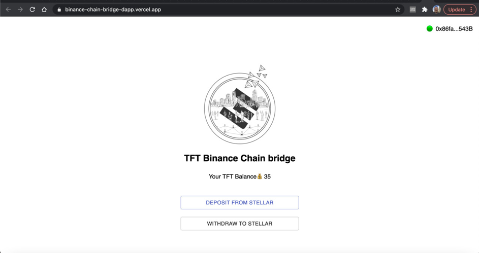

Wondering how to switch between blockchains? Cross-chain bridges allow you to easily transfer TFT from one blockchain to another. 

 

Since the launch of [ThreeFold Grid](https://library.threefold.me/info/threefold#/technology/threefold__threefold_grid) 3.0, [TFT](https://threefold.io/tft) has been available on three blockchains – Stellar, Binance Smart Chain and the Substrate-based ThreeFold Blockchain (aka TF Chain).

 

There are already active bridges that connect Stellar to Binance Smart Chain and [TF Chain](https://threefold.io/blog/post/tf_chain/), improving the accessibility and availability of TFT, while also connecting the ThreeFold ecosystem to external blockchain networks.

 

Learn more about TF Chain in our blog post [here](https://threefold.io/blog/post/tf_chain/).

## What are bridges and why are they important?

The concept of bridges in crypto is similar to a bridge in the physical world. Bridges in the real world simply connect two different locations and communities so that the people can travel back and forth and resources can be exchanged freely.

 

Similarly, using bridges in blockchain allows users to easily transfer tokens and other crypto assets between two or more networks – regardless of the different protocols, tooling, and governance models these networks have. Simply put, a bridge ensures a secure interoperability between different blockchains.

 

ThreeFold uses blockchain bridges to connect external blockchain networks to the ThreeFold ecosystem. The bridging mechanisms we’ve implemented allow TFT to be transferred securely between [different blockchains](https://library.threefold.me/info/threefold#/technology/threefold__money_blockchain_partity_link). Currently, we’ve established **two 2-way bridges**:

 

* Stellar <> Binance Smart Chain
* Stellar <> TF Chain

 

But what is the difference between the 3 chains?

 

**[Stellar](https://www.stellar.org/?locale=en)** is an open-source network for storing and moving digital assets, and still remains the main blockchain for the minting of TFT and distribution of farming rewards. Until the launch of TF Chain with Grid 3.0, only TFT living on Stellar were accepted for the reservation of Internet capacity on the ThreeFold Grid. 

 

**[Binance Smart Chain](https://www.binance.org/en/smartChain)** (BSC) is a standalone, parallel Binance chain that is a leading DeFi ecosystem next to Ethereum. On BSC, TFT is implemented as a cross-chain asset, allowing anyone to [connect](https://bridge.bsc.threefold.io/) to the bridge using [Metamask](https://library.threefold.me/info/threefold#/tokens/threefold__tft_bsc_metamask) or [Trust Wallet](https://library.threefold.me/info/threefold/#/tokens/threefold__threefold_wallets?id=the-threefold-connect-app) – the most popular Web 3 wallets in the world.

 

**[TF Chain](https://threefold.io/tech/tf-chain)** was built on the [Substrate framework](https://substrate.io/) with the purpose of decentralizing user-farmer relationships on the ThreeFold Grid. It has its own native form of [TFT](https://threefold.io/tft), which can be bridged back and forth from Stellar-based TFT. This model will be implemented for other chains in the future, for interoperability and cross-chain features between blockchain and DeFi ecosystems and the ThreeFold Grid.

## What’s new with TF Chain?

TF Chain represents a leap forward for simplicity in payments for capacity reservations and a move towards greater decentralization of the systems that support the ThreeFold Grid. With the launch of [ThreeFold Grid 3.0](https://forum.threefold.io/t/what-is-new-in-tfgrid-3-0/1133), TF Chain became the official record of ThreeFold farms and nodes, and brought peer-to-peer [billing](https://forum.threefold.io/t/introducing-tf-chain-an-updated-billing-model/1277) based on smart contracts for workload deployments on the ThreeFold Grid. 

 

For now, minting will remain on Stellar but reservations of nodes and capacity on ThreeFold Grid 3.0 are already executed via [TF Chain](https://library.threefold.me/info/threefold#/technology/threefold__tfchain). In the future, minting will also also be handled over TF Chain, as the creation of a custom blockchain for our ThreeFold Grid gives us great flexibility and scalability moving forward.

 

Bridges were established between Stellar and TF Chain to facilitate payments, e.g. if you pay for a workload deployment in Stellar TFT, this payment needs to be bridged to TF  Chain’s native TFT to fund the [smart contract](https://library.threefold.me/info/threefold#/technology/threefold__smartcontract_it).

### The two-way [bridge](https://bridge.bsc.threefold.io/) between Stellar & BSC 

Until recently, the bridge between Stellar and Binance Smart Chain (BSC) was one-way only: from BSC to Stellar. Even though it was possible to transfer TFT from Stellar to BSC via  [command line](https://github.com/threefoldfoundation/tft/blob/main/bsc/bridges/stellar/transfers.md), this was only an option for tech-savvy people. Now, you can also deposit TFT from Stellar to BSC using the bridge with a proper UI, as you can see in the image below.

 

 

When depositing from TFT Stellar, **please be sure that both addresses and memo are as indicated** in the instructions or the TFT you transfer will be lost forever. To facilitate the process, a **QR code** is generated and can be scanned using the [ThreeFold Connect app](https://library.threefold.me/info/threefold/#/tokens/threefold__threefold_connect), automatically filling in the right address and memo on your behalf.

 

 

As Binance Smart Chain is a more expensive chain, **a fee of 50 TFT** will be automatically charged for the bridge from Stellar to BSC. Find the full **step-by-step guide** for the Stellar-BSC bridge [here](https://library.threefold.me/info/threefold#/tokens/threefold__tft_bsc_bridge). 

## What’s next? 

As the ThreeFold ecosystem continues to grow, we’re looking into building more bridges (e.g. Cosmos, Ethereum), some of which are already under development, to improve the accessibility of TFT and simplify the onboarding of blockchain and DeFi projects on the ThreeFold Grid. TF Chain will play an important role in the further development of the People’s Internet as the main inter-chain for [TFT](https://library.threefold.me/info/threefold#/technology/threefold__threefold_token). 

 

*Try out the Stellar-BSC bridge [here](https://bridge.bsc.threefold.io/) and visit [our forum](https://forum.threefold.io/) to share your experiences.*

 

*Also, check out our blog post on TF Chain [here](https://threefold.io/blog/post/tf_chain/).*
