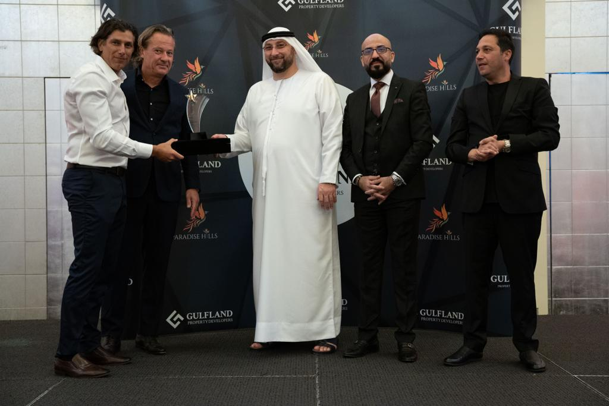

It’s January 2022. ThreeFold co-founder Adnan Fatayerji sits in the office of Shaher Mousli, CEO of Paradise Hills Development, along with Suhaib Sheikh, COO of the project. Shaher and Adnan are long-time friends and in fact Shaher gave Adnan his first internship in Dubai about two decades ago, while Adnan was in his final year at university.

 

Shaher is well-known in the Dubai real-estate market,  for his open-heartedness and transparency, and has a history of always looking for ways to stand out and differentiate himself and his projects. Paradise Hills in itself came from the idea of creating a “paradise” themed model for residents that could even serve as a tropical resting place for birds in Dubai.

## The “aha” moment

For the past twenty years, Adnan and Shaher have maintained a strong relationship, and on this day, they are gathering to find a way to work together – to bring things full circle. They discuss how the real estate market is making a strong comeback, and various types of value propositions for future Paradise Hills residents, when the incredible “aha” moment drops. Instead of a standard one-time gift or fee write-off, why don't we add a 3Node to each residence? A gift that keeps on giving! The room is filled with excitement. They realize that a new dawn in the property and homeownership market is born, combining the unified empowerment of digital and physical assets.

 

 

Together, ThreeFold and Paradise Hills will collaborate on a [historic partnership](https://threefold.io/news/post/paradise_hills/) to create the world’s first neighborhood cloud network, living on top of the ThreeFold Grid. Dedicated servers called 3Nodes will be installed into 170 homes, providing the edge computing and Internet storage needed to run decentralized applications and Internet services. This will give residents, businesses, developers, and the government a secure and highly-available sovereign cloud infrastructure to store and process their data locally. And homeowners will be rewarded in the form of ThreeFold Tokens (TFT) simply by having these 3Nodes connected.

## No time to waste

Quickly the team puts the idea to paper, and by February the deal is done. In March, the collaboration is announced and makes the rounds in publications like [Yahoo! Finance](https://finance.yahoo.com/news/paradise-hills-property-development-threefold-090000146.html) and on plenty of regional properties. Adnan even begins training the Paradise Hills sales team on how to present the opportunity to potential residents. The speed of the collaboration is proof of a collective commitment to take this leap of faith, and a high-level of trust in each other and the possibilities. Another big reason for confidence: once the modeling was done, it was clear that this could be a massive financial opportunity for residents, one which could even pay off the cost of the house in a relatively short number of years.

 

 

The ThreeFold [3Node](https://threefold.io/farm) will be a standard “appliance” in each Paradise Hills residence, much like a refrigerator or an oven. But this appliance is anything but “standard” – it provides and connects decentralized Internet capacity owned by the Paradise Hills community, and comes with an onboarding guide to welcome each resident into the much larger ThreeFold community.

 

Further, Paradise Hills is adamant about building tools on top of the ThreeFold Grid – digital storefronts for local businesses, peer-to-peer marketplaces and forums or chats for the residents, and whatever else is deemed to be needed. The collaboration with ThreeFold essentially turns Paradise Hills into a sovereign “smart” community, where even the footage from the security cameras on premise can be stored locally and privately.

## The community comes together

Flash forward to a few weeks ago, the early Paradise Hills community gathers together for a gala. ThreeFold co-founder and tech guru Weynand Kuijpers has the chance to speak in front of the group. He speaks about the early days of the Internet, how it was hijacked by Big Tech turning people into products, and how now there is a new model for the Internet by people, for people. “You are some of the first to do this,” he says to the crowd.

 

 

Afterwards, residents come up and express their excitement, even if they don’t quite understand all the details. One woman in particular asks, “Can you please explain to me how having this device in my home won’t impact my privacy or security?” Adnan goes on to describe how the 3Node is actually there to preserve privacy and security. “A 3Node is just like a solar panel, only instead of electricity, it provides Internet capacity for local usage. In fact, any data that’s in your home is just a fragment of a piece of a puzzle, so it’s inaccessible to you or anyone else for that matter.” Overall, there is a clear feeling that contributing to this new Internet Grid will bring a unifying force to the community, and a deeper sense of meaning for what it means to be a resident of Paradise Hills.

## Bringing Paradise to the world

Paradise Hills is a first of its kind partnership, but it is only the first. We at ThreeFold see incredible opportunities to scale this model across the world, and not only in real estate developments. Imagine if we apply this to lower-income and affordable housing communities, or colleges and universities. Hardware gifted to residents that connect together to form a localized part of a truly sovereign Internet Grid, on top of which useful community tools can be built – all while generating passive token rewards for the residents. A ground-up model. A global concept, applied locally.

 

If the Paradise Hills story inspires you, and you have an idea for how to bring this model elsewhere, we invite you to take action. Head to the ThreeFold Forum, create a topic under the [Paradise Hills Model](https://forum.threefold.io/t/about-the-paradise-hills-model-category/2632) category, and let’s spread this to the world.