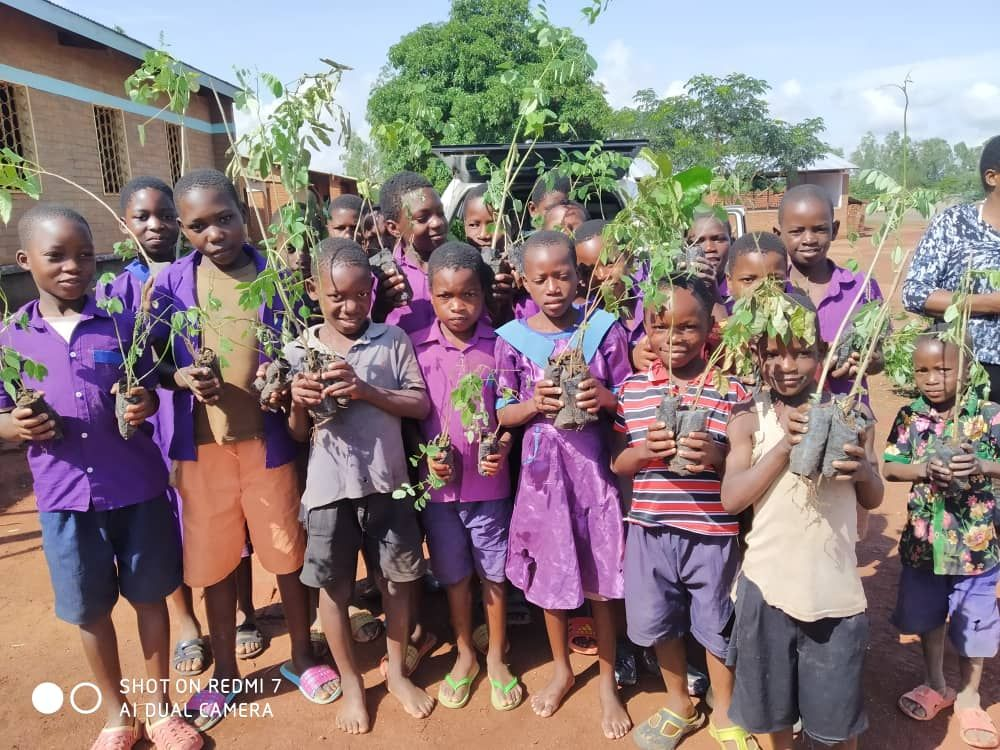

*‘Being sustainable’ has become a buzzword – a claim to boost our image rather than an honest endeavour. It is hard to trust people and brands today when we fear to fall into the trap of greenwashing. However, we have no choice but to change our collective behaviour, consumption patterns and business practices if we want to combat climate change and the collapse of biodiversity.*

 

Last November, [COP26](https://www.nature.com/articles/d41586-021-03431-4) shed light on how indecisive our global institutions and governments are in the face of an unprecedented climate crisis. We now have to come to terms with the fact that carbon neutrality is no longer enough. Rising carbon emissions have been linked to an increasing amount of heat waves, droughts, floods and hurricanes globally. It is our collective responsibility to reverse the unintended consequences of our actions. 

 

Did you know that warnings about the risks and harms of excessive carbon emissions date back as far as the 1960s to [a report](https://www.climatefiles.com/climate-change-evidence/presidents-report-atmospher-carbon-dioxide/) by former US President Johnson’s Science Advisory Committee? We’ve clearly been inactive and ignorant for far too long. There’s always another crisis, another challenge to tackle. But we cannot afford to ignore climate change and biodiversity loss any longer.

 

 

We need to tackle the climate crisis with the same urgency, force and determination we do with other crises. And we finally need to face the reality and severity of the climate crisis! After all, Greta Thunberg is right: “Nature does not bargain and you cannot compromise with the laws of physics.”

 

The time has come for us to put our planet first. It is our duty to regenerate our planet and to support the right practices and organizations aligned with our vision of tomorrow. Now’s the time for regenerative action.

## How to save our planet

*“The greatest threat to our planet is the belief that someone else will save it.” – Robert Swan*

 

By taking action and making the right choices for our planet and humanity, we can prevent the truly [severe levels of global warming](https://www.technologyreview.com/2021/12/23/1042973/climate-change-action-progress-clean-energy/) and restore the health of our planet. Once emitted, carbon dioxide can persist in the atmosphere for several hundreds, possibly thousands, of years. So, it all starts with reducing global emissions to the lowest level possible. In addition to that, we’ll need to compensate for those emissions that cannot be avoided as well as for all of the carbon and other greenhouse gases we’ve emitted in the past.

 

As most technological solutions for carbon removal remain expensive and early stage, nature-based solutions are the way forward. And trees, as the world’s largest plants, are an effective way to store carbon.

 

So, what are we doing at ThreeFold? How are we contributing to restoring the health of our planet? How are we taking climate action?

## Our commitment

We believe our planet needs regenerative solutions at a large scale. Our motto is: planet first, people second, profit as a result. Without a healthy planet, humanity can’t survive and no economy can exist.

 

While the [ThreeFold Grid](https://library.threefold.me/info/threefold#/tfgrid/threefold__tfgrid_home) is already much more [energy efficient](https://threefold.io/blog/post/for_our_planet/) than the traditional Internet, there will always be energy consumption and emissions that cannot be avoided – and thus have to be compensated for. We’re not just going for the carbon neutrality of the ThreeFold Grid but for carbon negativity (or as we prefer to call it, planet positivity), i.e. offsetting its emissions three times through planting and protecting trees.

 

And we decided to empower our community to take part in our regeneration efforts in a low-threshold way. ThreeFold Farmers will automatically compensate for their 3Nodes’ carbon footprint three times, and everybody will be able to use the ThreeFold Grid’s regenerative Internet capacity while simultaneously supporting impact initiatives.

 

As we shared in our Planet-Positive Farming Series, we’re setting the plan for a planet-positive Internet by implementing a [Voluntary Carbon Credits](https://forum.threefold.io/t/threefold-on-track-to-be-planet-positive/2097?u=hannahcordes) (VCC) system and supporting [planet-positive initiatives](https://forum.threefold.io/t/supporting-initiatives-to-regenerate-the-planet/2110?u=hannahcordes) with our trusted partners from [Take Action Global](https://forum.threefold.io/t/driving-regeneration-with-tag/2120?u=hannahcordes) (TAG). 

## Driving regeneration with Take Action Global

We’re aiming to realize the initial promise of the Internet while also regenerating the planet. Our decentralized Internet infrastructure is already highly [energy efficient](https://threefold.io/blog/post/internet_energy_consumption/) – we’re using about 10 times less energy than any comparable alternative. In December 2021, we [announced](https://www.prnewswire.com/news-releases/threefold-and-take-action-global-partner-to-bring-internet-access-to-1-billion-people-across-the-globe-301446693.html) our commitment to achieve a [carbon double win](https://forum.threefold.io/c/ecosystem-developments/sustainability/90) for the ThreeFold Grid.

 

Together with [TAG](https://threefold.io/partners/take_action_global/) – experts on climate action and education who were [acknowledged](https://twitter.com/threefold_io/status/1493980240275812352?s=20&t=uW8aclYr82-xqQkEsCeGWw) for their incredible work by the Anthem Awards – we kicked off a pilot program for tree planting. After measuring the carbon footprint of the Grid and individual [3Nodes](https://threefold.io/farm), we knew what it would take to go beyond climate neutrality and fulfill our planet-positive commitment.

 

With our tree planting initiatives in Sierra Leone, Malawi and Cambodia, we’re planting enough trees in 2022 to lay the foundation for achieving and sustaining a carbon double win for our Internet infrastructure. Already, students and teachers in the three countries have planted more than 5,300 trees. Find out more about the pilot program [here](https://forum.threefold.io/t/driving-regeneration-with-tag/2120?u=hannahcordes) and head to the [EarthProject](https://earthproject.org/treeplanting) page for the tree-planting details and how you yourself can get involved.

 

 

 

Once we’ve laid the foundation for the ThreeFold Grid’s carbon double win, we will continue to produce Voluntary Carbon Credits to finance further impact initiatives, such as fostering climate education and renewable energy grid developments to enhance the life of communities.

## A regenerative Internet for the planet and the people

We all need to take responsibility and to pull our own weight. But we’re in this together. And together, this will happen. After kicking off our [pilot program](https://forum.threefold.io/t/driving-regeneration-with-tag/2120?u=hannahcordes) a month ahead of schedule, we’re well set to achieve the carbon double win for the ThreeFold Grid – driving the regeneration of our planet.

 

We are pioneering the creation of an [energy-efficient](https://threefold.io/blog/post/internet_energy_consumption/) and regenerative Internet built and owned by the people. The ThreeFold ecosystem consists of like-minded individuals and partners that share our values and support us in our mission. United in our shared beliefs in open source, peer-to-peer, equality and inclusion, we come together to build a better Internet. And we’re being acknowledged for our work – we’re [nominated](https://evenements.optionfinance.fr/les-debats-finance-impact-rse/content/candidats-sia) for the Sustainable Investment in Action [Awards](https://sustainableinvestmentinaction.com/awards-conferences-2022/) in the category “Basic Needs”.

 

We’re making it easy for everyone to join us – all you have to do is connect a [3Node](https://threefold.io/farm) to the ThreeFold Grid and you’ll effortlessly regenerate the earth through providing Internet capacity – a process we call ‘farming’ because it’s a greener, purposeful [alternative](https://threefold.io/blog/post/farming_a_greener_alternative_to_crypto_mining/) to crypto mining.

 

Are you ready to [join us](https://t.me/threefold) in our mission?

 

And don’t forget:

 

*"What we do today will determine what the world looks like tomorrow." – Marie von Ebner-Eschenbach*

 

*P.S.: If you have ideas or suggestions for further planet-positive initiatives or potential partnerships, let us know on our [forum](https://forum.threefold.io/c/ecosystem-developments/sustainability/90).*
