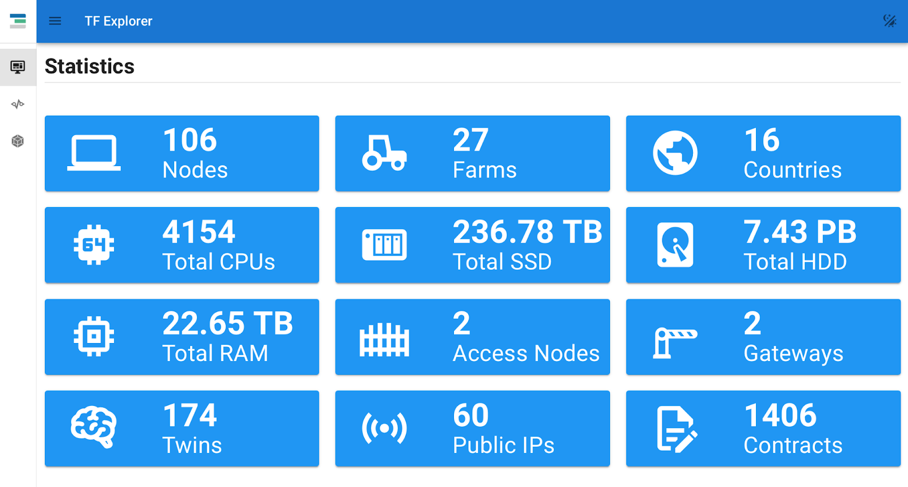
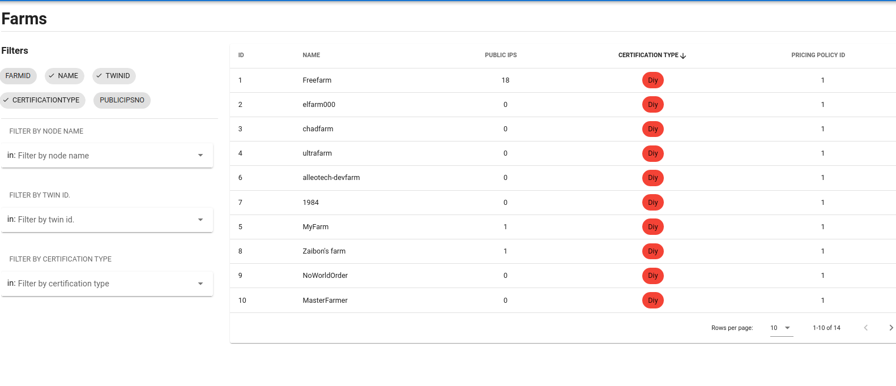
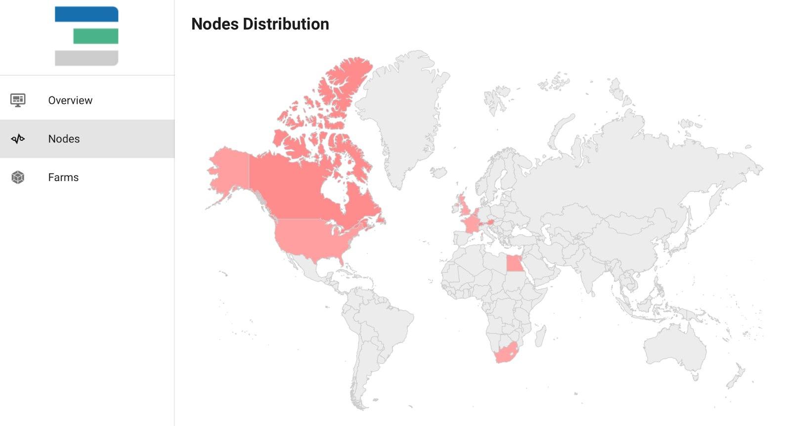

We are very excited to present to you the new Explorer UI for ThreeFold Grid 3.x! 🎉

 

The Explorer was designed to provide **a simple way for anyone to find decentralized Internet capacity on the ThreeFold Grid**, and we’re thrilled to announce a new user interface for Grid 3.x on both [testnet](https://explorer.test.grid.tf/) and [devnet](https://explorer.dev.grid.tf/). 

 

The new explorer builds upon the recent migration to the Parity Substrate, **bringing true decentralization** to the way compute, storage and network capacity information is sourced from 3Nodes. The previous [explorer](https://explorer.grid.tf/) (used for 2.x) has been sourcing its information from a centralized database as TF Chain was still under construction. Now, the new explorer receives its information via [GraphQL](https://library.threefold.me/info/manual/#/manual__explorer_graphql_intro) **straight from the [ThreeFold Blockhain](https://library.threefold.me/info/manual/#/manual__grid3_tfchain_init)**.

## What is GraphQL?

[GraphQL](https://graphql.org/) is an open source data query language for APIs. The GraphQL interface queries our blockchain and displays the information registered on it in a command-line interface. We, in turn, created a graphical representation of that information in our explorer.

## What to expect from the new Explorer UI

The **new [Explorer UI](https://library.threefold.me/info/manual/#/manual__explorer_home)** allows you to **explore the available Internet capacity** connected to ThreeFold Grid **easier than ever before**. As of now, the new Explorer displays data about the compute, storage, network and gateways connected to the Grid 3.x testnet and devnet by ThreeFold Farmers.

 

The statistics section gives you **an overview of [key information](https://explorer.test.grid.tf/)** about our testnet (as of November 30th, 2021) as displayed below. Our farmer community has already connected **more than 100 nodes (across 16 countries)**, and we have seen **more than 1,400 contracts deployed** on the ThreeFold Grid 3.0 testnet since its launch.

 

 

*All screenshots in this post are from the ThreeFold Grid 3.x testnet Explorer, and the numbers are growing continuously.*

 

Once a farm ID gets registered to **the new [TF Chain Portal](https://library.threefold.me/info/manual/#/manual__tfchain_portal_home)**, all the relevant information (e.g. uptime, nodes specifications, location) of farms are automatically displayed on the Explorer for users to find their ideal decentralized Internet capacity. 

 

Users can now explore all farms and [3Nodes](https://threefold.io/farm/) using **multiple filtering options** (e.g. farm name or farm ID), making it simpler than ever before to find the decentralized Internet capacity they are looking for. 

 

Not sure what the new Admin Portal is about? We’ve covered all the details in **our [previous update](https://forum.threefold.io/t/introducing-the-tf-chain-admin-portal-for-farmers-and-grid-users/1526)**, check it out!

 

 

 

We also made the world map bigger to improve the display of the available decentralized Internet capacity.

 

 

Dark mode is finally available for the ThreeFod Grid 3.x, bringing **a more comfortable navigation** for some of us. Just click on the crescent/sun icon in the upper-right corner of the screen, and you’re good to go.

 

 

We invite you to **take a look at the ThreeFold Grid 3.x Explorer UI overview** with more details **[here](https://library.threefold.me/info/manual/#/manual__explorer_ui)**.

 

*Keep in mind, the overview of all 3Nodes worldwide across all nets can be found [here](https://explorer.grid.tf/) and this will phase out as we approach 3.x mainnet launch as shared on our previous [update](https://forum.threefold.io/t/whats-new-in-tf-grid-3-0-1-and-the-path-to-mainnet/1488).*

 

*Visit our forum to share you experiences with the new explorer interface [here](https://forum.threefold.io/t/the-threefold-grid-3-x-explorer-ui/1536).*
