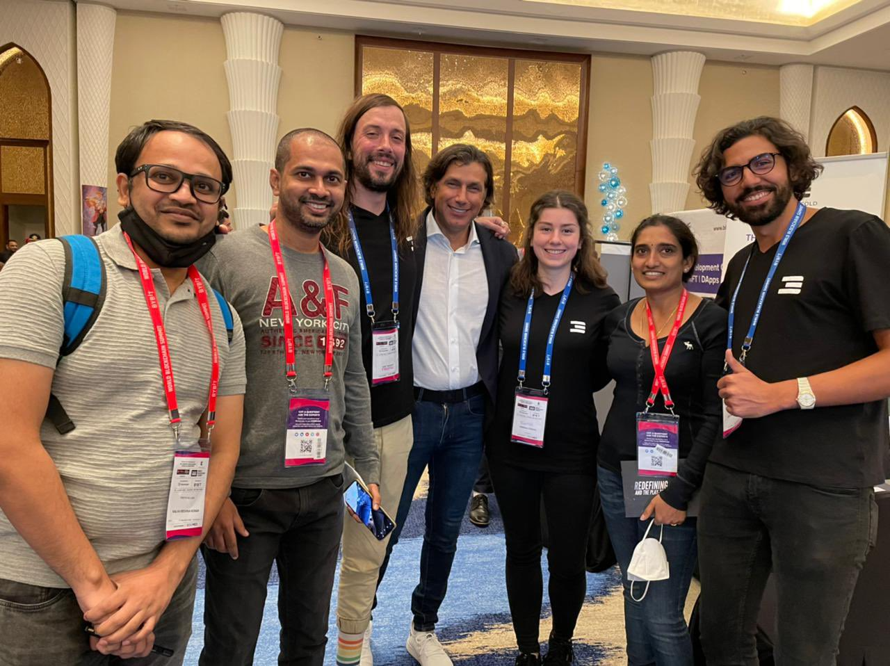

*We have a new format for ThreeFold Weekly, now on our blog. If you'd like to review any of the first eleven editions, please find them on [our forum](https://forum.threefold.io/c/ecosystem-developments/41).*

## Major ThreeFold News:

* Members of the ThreeFold team attended the **[World Blockchain Summit](https://mobile.twitter.com/threefold_io/status/1507009092165853185)** in Dubai. Over two days we exchanged with countless people and their reactions were unanimous – ThreeFold is undeniably one of the most exciting projects in the blockchain space. We’re excited to join many more events this year to drive the ThreeFold movement forward!

 

 

* Yesterday, we participated in the [6th track](https://gitlab.com/gaia-x/gaia-x-community/gx-hackathon/gx-hackathon-3/-/wikis/GX-Hackathon-3#track-6-deployment-of-ecosystems-minimal-viable-gaia-x-track) of the **Gaia-X Hackathon**. Our tech gurus Geert and Weynand presented **ThreeFold** and guided participants through the deployment of workloads on ThreeFold Cloud in a **hands-on session**.

 

ThreeFold was **featured in the news twice** last week:

 

* [The Future Is Now: Kristof De Spiegeleer Of ThreeFold On How Their Technological Innovation Will Shake Up The Tech Scene](https://medium.com/authority-magazine/the-future-is-now-kristoff-de-spiegeleer-of-threefold-on-how-their-technological-innovation-will-7acc0e51c365) (Interview with Authority Magazine)

 

* [ThreeFold: Is the Decentralized Web the Future of the Internet?](https://coincheckup.com/blog/threefold-is-the-decentralized-web-the-future-of-the-internet/) (Coverage on CoinCheckup Blog)

### Community updates:

* Kyle Ellicott and Kristof de Spiegeleer discussed **how ThreeFold is [decentralizing the Internet](https://www.youtube.com/watch?v=5xzwg-CdJNk)** and how it is more relevant than ever before.

 

* We’re collecting [farmer stories](https://forum.threefold.io/t/looking-for-farmer-stories-to-share-with-the-world/2398?u=hannahcordes) to **share about the people behind ThreeFold** – a globally diverse community united around the mission of building an open-source, peer-to-peer Internet, owned by humanity.

 

* Only **8 [L2](https://forum.threefold.io/t/procedure-to-register-your-l2-validator-node/1864) and 3 [L0](https://forum.threefold.io/t/procedure-to-register-your-l0-validator-nodes/1866) validator spots remain**. We are grateful to know that the people behind the validators believe in a decentralized future and want to take part in a meaningful way. Learn how to stake TFT and become a validator [here](https://threefold.io/blog/post/stake_tft_become_validator/).

### Technology Developments:

* The **[ThreeFold Grid version 3.0.0 A5](https://forum.threefold.io/t/announcement-of-tfgrid-3-0-0-a5/2522?u=hannahcordes)** was released on Devnet. Testnet will follow soon.

 

* TF Grid v3.0 A5 will support **[dedicated nodes](https://forum.threefold.io/t/dedicated-node-support/2521)**.

### ThreeFold Grid: 

* **Hurry up and migrate your 3Nodes from V2 to V3**. As a **decentralized community, it’s our collective responsibility** to ensure we’re powering the latest version of our technology for feature and security reasons. Follow the migration process via ThreeFold Connect [here](https://forum.threefold.io/t/farming-migration-grid-v2-v3/2143?u=hannahcordes).

 

* Please remember that the minting payout for March 2022 will be executed on the 8th of April instead of the 5th of April.

 

* We created a **new [pricing calculator](https://forum.threefold.io/t/new-pricing-calculator-and-suggested-price-change/2520) for TF Grid deployments** and are looking for [feedback](https://forum.threefold.io/t/pricing-for-tfgrid/2518/3).

 

* 3Node deliveries to all parts of the world continue. If you ordered a Titan recently, please fill in this  [specific migration process](https://forum.threefold.io/t/farming-migration-grid-v2-v3-open-unshipped-orders/2144) to ensure quick delivery.

 

See you next week, everyone!  🙌 

 

*You can find all earlier editions of ThreeFold Weekly along with the ThreeFold Product Updates [here](https://forum.threefold.io/c/ecosystem-developments/41).*
