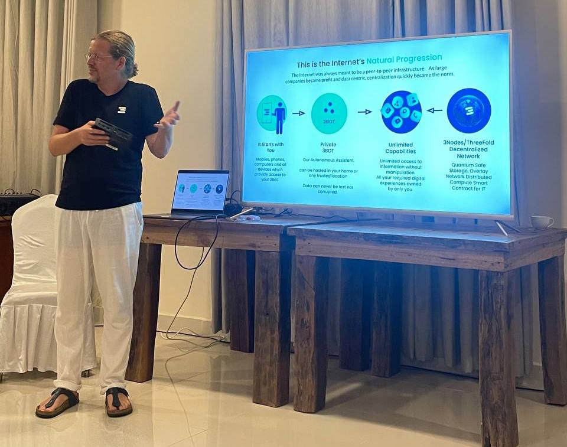
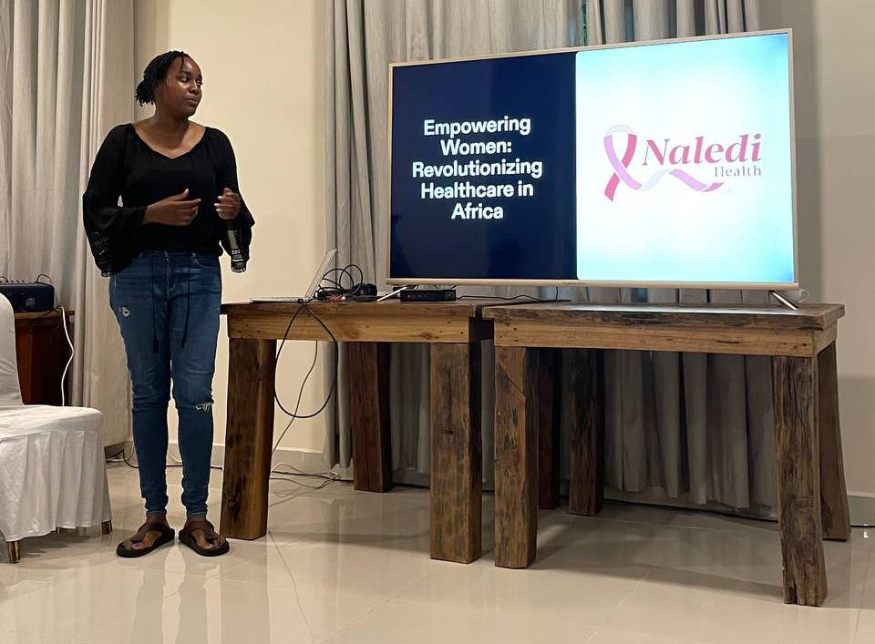
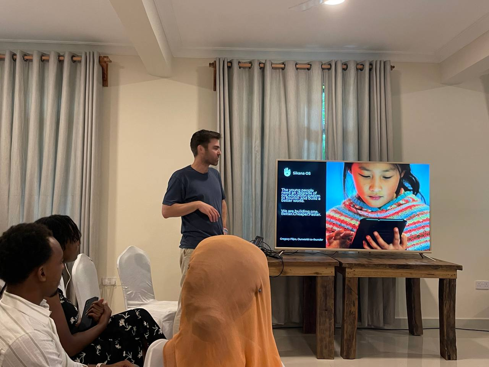
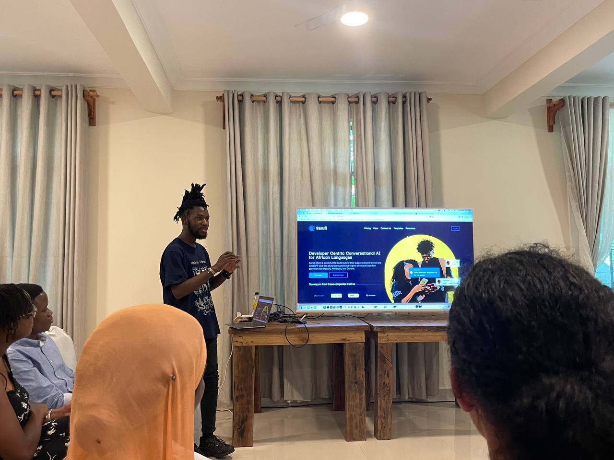
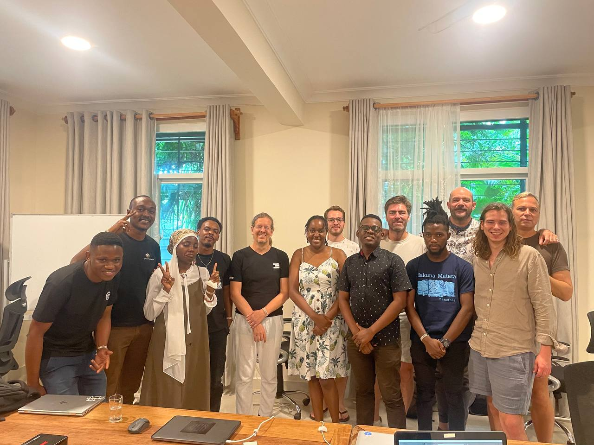

*The below is an update from a summit we held here in Zanzibar this past weekend called the Africa Regenerative Futures Summit. It was a follow-up of [an event we hosted in July](https://youtu.be/GIBlmID7g5o?t=246&si=KYEExcPFHUCU7HKY). And we aim to continue to host this as a series of gatherings around OurWorld, ThreeFold, and other planet-first people-first projects and individuals who are supporting or want to support Tanzania and the African continent as a whole.*

 

On the 16th of November, we had a roundtable covering important relevant topics (Cyber Pandemic, AI, Quantum Computing, etc.) and explaining the core vision of OurWorld and ThreeFold in context to what is currently happening in today’s world as a whole.

 

Over the course of Friday and Saturday morning, we delved into an exciting array of projects, with a focus on experiencing two inspirational mornings that provided valuable insights into the current landscape of OurWorld and its affiliated initiatives.

### **Friday Morning Highlights**

**OurWorld Infrastructure (Kristof De Spiegeleer):** Kristof gave us a deep dive into the foundational aspects of [OurWorld](https://ourworld.tf) Infrastructure, explaining the [ThreeFold](https://threefold.io) technology and how it serves as a foundation for a wide array of impactful projects.

 

 

**Hub Culture (Stan Stalnaker):** Stan Stalnaker presented his [HubCulture](https://hubculture.com) platform, highlighting its role and impact as a Network State.

 

**Fumba Permaculture Project (Franko Gohse):** Franko shared his work on the [Fumba](https://fumba.town/) Permaculture Project, detailing its sustainable and regenerative initiatives.

 

**Naledu Health (Stephanie Ndungu):** Stephanie is a wonderful project to raise awareness of breast and other cancers in Kenya and reach out to local women and children to screen them for free. Her idea will be to devise an AI-powered SMS solution that could help them seek treatment if they show symptoms.

 

 

**Dark Matter Labs (Raj Kalia):** Raj Kalia presented the vision and initiatives of [DM Labs](https://darkmatterlabs.org/About), offering a glimpse into the innovative ventures they are supporting.

 

**HedUnity (Tim Degraye):** Tim presented his company HedUnity and his first wifi headphone which can stream lossless uncompressed Hi-Res audio up to 96kHz 24-bit, [Unity](https://www.getunity.com).

 

### **Saturday Morning Startup Sessions**

**TechBridge Institute (Justine Mahinyila):** Justine presented his exciting new project to help Tanzania’s technology community, ensure inclusive and equitable quality education, promote lifelong learning opportunities for all, as well as sustainable economic growth, full and productive employment and decent work for all.

 

**Sikana (Greg Flipo):** Greg discussed the [Sikana](https://www.sikana.tv/en) project, how he sees the future of the platform, emphasizing its significance and contributions within the OurWorld ecosystem.

 

 

**HATCH (William Chamberlin):** William introduced [HATCH](https://hatchexperience.org), a global network of changemakers, illustrating its potential to drive positive transformation on a global scale.

 

**Chatafisha (David Machuche + Victor Muhagachi):** David and Vic shared insights into ReFi Tanzania and Regen Tech, showcasing their [projects](https://chatafisha.com) that aim to make a positive impact on communities.

 

**Sarufi (Kalebu Jordan):** Kalebu shed light on the development of conversational AI tailored [for African languages](https://sarufi.io), addressing a critical need in tech accessibility.

 

 

On the fourth and final day, we spent time with some of our friends participants from Dar Es Salaam and Kenya to understand each others’ collective goals and put together a collaboration plan, which involves deploying ThreeFold infrastructure locally and working together in the coming months on developer sessions and hackathons. The team is really looking forward to supporting and working together with this community and we’ll [provide updates](https://forum.threefold.io/t/introducing-dunia-yetu/4147) as we have them.

 

