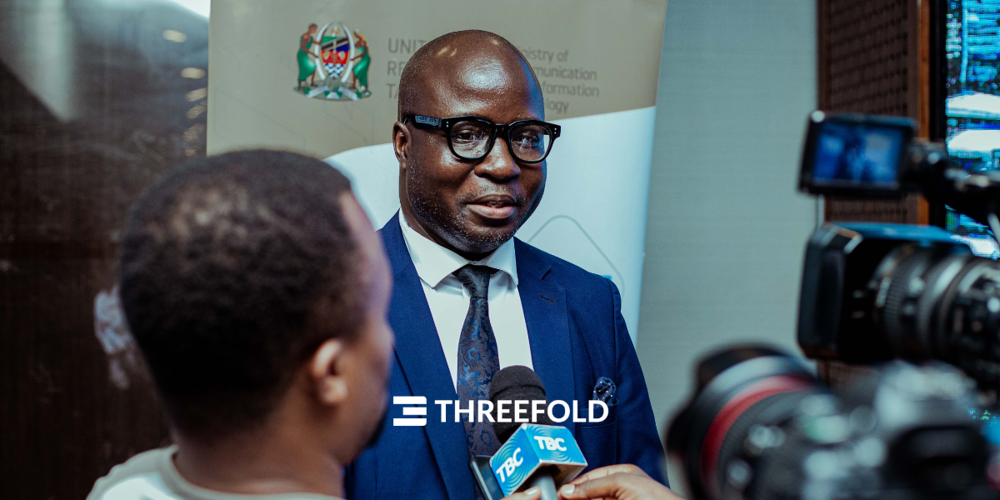
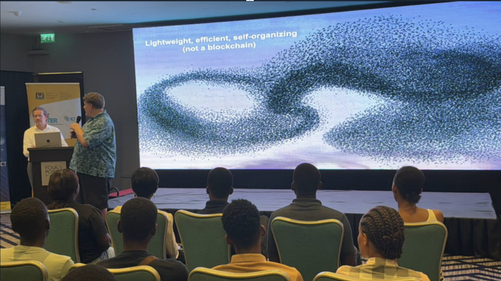
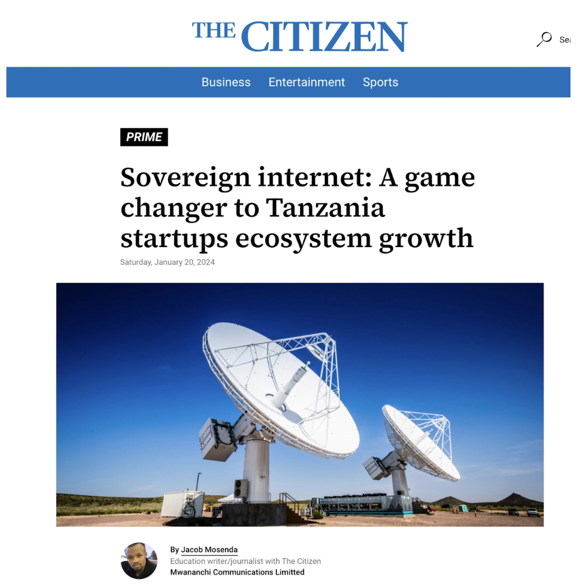

Last Friday, we were pleased to formally and publicly announce Dunia Yetu, together with Dr. Nkundwe M. Mwasaga, the Director General of Tanzania’s ICT Commission, and Arthur Brock, co-founder of Holochain. The announcement was made in front of an audience of representatives from the Tanzanian Government and the tech community of Dar Es Salaam. More than 200 people have signed up, expressing their interest in taking part.

 

Ideated in November 2023 between ThreeFold and a group of developers and tech innovators from Dar Es Salaam, Dunia Yetu, which means Our World in Swahili, is a collaborative and co-owned movement to redefine the digital landscape in Tanzania and East Africa, empower coders, spur economic development, and build a self-reliant sovereign digital ecosystem for a better digital future.

 

In the future, Dunia Yetu will introduce coding academies to empower startups and entrepreneurs in Dar Es Salaam and beyond to build the apps of the future – faster, more secure, more reliable, and built on top of local infrastructure deployed in Tanzania.

 

_“We believe young people in this country have all the talent to build together their digital future and we want to empower them as much as we can,”_ said ThreeFold co-founder, Kristof De Spiegeleer.

 

 

_The government of Tanzania represented by "The Director-General of the ICT Commission, Dr Mkundwe Mwasaga has fully endorsed the roll out and establishment of such a nationwide internet._

 

Further, alongside the ICT Commission, we will create a network of distributed innovation hubs providing space for events, coding academy workshops and collaborative projects.

 

_“We are building these centers, starting with six regions in Tanzania, to ensure that we can create an environment where talented young people even in the country’s rural areas can provide their innovation,”_ said Dr. Mwasaga of the ICT Commission.

 

At the event, Holochain co-founder Arthur Brock also presented, and will be part of this deployment. Holochain is a world-renowned project that enables decentralized applications to be developed without recourse to blockchain technology, thus achieving greater security and performance. 

 

Said Arthur Brock, co-founder of Holochain, _“We have been building our framework for decentralized applications for years to support new social applications across the globe, and we are delighted to share as much of our knowledge as we can to coders and developers of Tanzania who want to build a new digital future.”_

 

 

Some of the first Tanzanian community projects involved in Dunia Yetu include Chatafisha, led by Victor Muhagachi and David Machuche, which aims to regenerate marginalized communities through innovative technologies, and Sarufi, led by Kalebu Gwalugano, which builds developer-centric conversational AI for African languages.

 

In fostering Dunia Yetu, we together aim to catalyze a wave of transformative innovation throughout East Africa, starting with Tanzania. This collaborative venture not only aligns with the visionary leadership of H.E. Dr. Samia Suluhu Hassan, President of Tanzania, but also signifies a powerful commitment from the ICT Commission, ThreeFold, Holochain, and the vibrant tech community of Dar Es Salaam and Tanzania at large.

 

As we embark on this journey, we invite stakeholders, partners, and enthusiasts to join hands with us in shaping a digital ecosystem that propels Tanzania and East Africa towards a brighter, tech-driven future. Together, let us chart new horizons and amplify the impact of Dunia Yetu across the realms of technology, entrepreneurship, and community development.

 

**Our event was covered by the media in Tanzania:**

 

- National TV Coverage

 

<iframe src="https://player.vimeo.com/video/919967495?h=340e62170b&amp;badge=0&amp;autopause=0&amp;player_id=0&amp;app_id=58479" frameborder="0" allow="autoplay; fullscreen; picture-in-picture; clipboard-write" style="position:absolute;top:0;left:0;width:100%;height:100%;" title="TBC NEWS JANUARY 19, 2024 | Sovereign internet: A game changer to Tanzania"></iframe>

 

<iframe src="https://player.vimeo.com/video/920060589?h=d033b79295&amp;badge=0&amp;autopause=0&amp;player_id=0&amp;app_id=58479" frameborder="0" allow="autoplay; fullscreen; picture-in-picture; clipboard-write" style="position:absolute;top:0;left:0;width:100%;height:100%;" title="Channel Ten (19/01/24) - ThreeFold X ICT Commission event in Dar Es Salaam"></iframe>

 

- Coverage in newspapers : The Citizen is one of not the most reputable newspaper in Tanzania, here is the article: 

 

 

- [Link to the Citizen](https://www.thecitizen.co.tz/tanzania/news/national/sovereign-internet-a-game-changer-to-tanzania-startups-ecosystem-growth-449806)
- [Article](https://drive.google.com/file/d/1vslgKVm-pddaBKFKFZR1b3o2UvmPZnFH/view)

 

If you are interested in staying informed about Dunia Yetu or would like to participate, we welcome you to our community group. Next steps to follow.

 

**More Information:**
- [Used Slides](http://duniayetu_event_slides.ourworld.tf)
- [ThreeFold](www.threefold.io)
- [Holochain](https://www.holochain.org/)
- [ICT Commission](https://www.ictc.go.tz/)