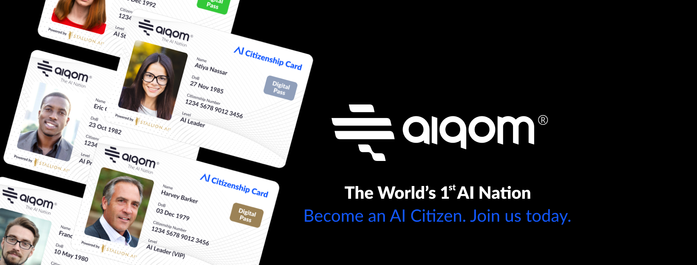
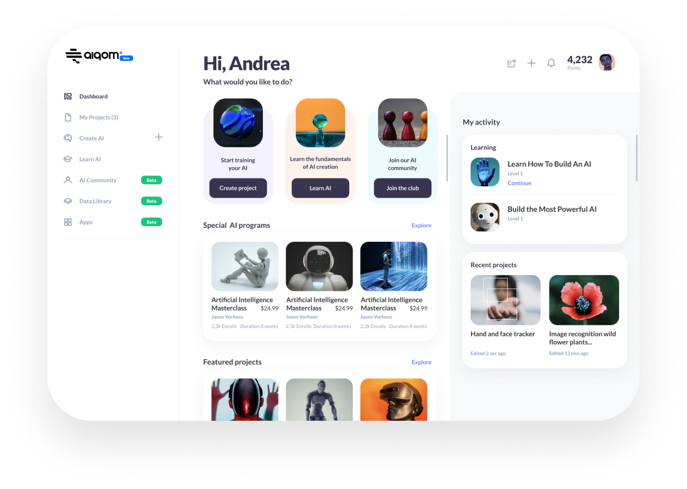

 

 

## About

[AIQOM](https://aiqom.ai/) platform, powered by Stallion AI, is led by a group of machine learning PhDs, physicists, computer engineers, data scientists, developers, serial entrepreneurs and business leaders who are passionate about revolutionizing the future of enterprises in public and private sectors with AI and machine learning technologies. Stallion AI provides AI services, solutions and products to help organizations across different industries to implement AI today. Our AI research and development facilities in Canada, US, Cyprus, KSA, Jordan and UAE allow us to solve today’s complex problems, customize real-life AI applications for positive future impact, and drive future innovation.
 
 
AIQOM is a leading AI R&D lab and is backed by impactful angel investors, visionary machine learning scientists, neuroscientists, thoughtful government and business leaders and impactful entrepreneurs.

## Mission

To unlock Special AI Powers. To make your AI Identity See, Read, Hear, Calculate, Feel, Think and Predict. To bring Your AI Creations To The World.

## Impact

AIQOM empowers people of all ages to become responsible AI Citizens to easily learn and create machine learning models. Their platform allows users to export and integrate their AI with websites, mobile apps, games, drones, vehicles, smart homes – and even their actual physical programmable robots.
 

 

## Powered by ThreeFold

AIQOM want to use the ThreeFold's [3Bot technology](https://threefold.io/info/threefold#/threefold__part2_decentralized_is_different_centralized) as a backend to their AI system. 3Bot technology will help provide more privacy, scale and energy-efficiency to AIQOM personal AI solutions. Additionally, AIQOM can make Digital Twins more intelligent and responsive in a sustainable way to satisfy the needs of our day-to-day digital life. It is the fusion of AI and our personal digital life.
 
 
Expectation is to have joint products out by end 2021.
