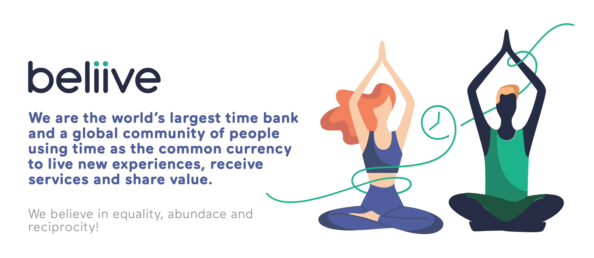
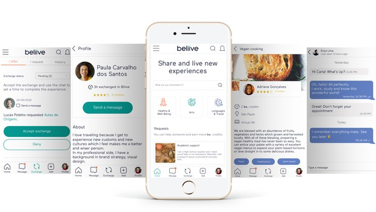

 

 

## About

[Beliive](https://beliive.com) is a community where people can exchange experiences and services using time as the only currency. With 200,000 members to date Beliive is the world's largest time bank. Our vision is to be a movement that rethinks and rebuilds the value of money, the value of time and the way we collaborate with each other. When the money economy is failing at giving us a way to exchange our value independently of the circumstances, Beliive decided to create a complementary economy based on an abundant resource available to everyone equally.

 

<iframe src="https://player.vimeo.com/video/413225889" width="800" height="450" frameborder="0" allow="autoplay; fullscreen" allowfullscreen></iframe>

 

## Mission

Our mission is to empower and inspire people to recognize abundance by living new experiences one hour at a time.

## Impact

We have created a platform where low-income and unemployed people can exchange their time (hours) of volunteering for knowledge and skills. To scale this and to allow for collaboration opportunities, Beliive has an open API and a web widget that can integrate our time banking technology with different platforms and systems. Soon our time credits will use blockchain technology.

 

 

## Powered by ThreeFold

Beliive and ThreeFold recognize the power of equality to include and connect people to their unlimited abundance. We are peer-to-peer systems that are here to support the awakening of humanity to its own potential. Beliive will connect users' wallets and identity with ThreeFold, using its technology to support time exchange transactions. Beliive will also connect time credits to TF Foundation partners and communities, providing a peer-to-peer platform for TF Foundation to spread the use of time credits for economic empowerment.

## Join saving our planet!

The world has 3 trillion idle hours per year and Beliive is using TIME as the common currency to promote reciprocal exchanges and financial inclusion. With Beliive you can offer for example one hour of Spanish Lessons receiving a time credit of one hour in return, then you can exchange this credit for any activity available in the community, like financial advice, dance lessons or someone to fix something for you.

<!-- ## Support this project

Beliive is included in ThreeFold’s [Token Distribution Event (TDE)](https://library.threefold.me/info/tfgrid/#/tdeoverview)</a> for the impact it brings to our planet, humanity and the ThreeFold Grid.
The ThreeFold Token (TFT) represents a unit of capacity on the new Internet and is created only when new capacity is added to the ThreeFold Grid.
Each project on the TDE benefits from TFT fund allocations. You can buy TFT's and support Beliive, and the growth of a new Conscious Internet.

## TFGrid Solution

### Roadmap

- Q1 2021
    - API integration
- Q3 2021
    - Crystal Twin Integration -->

