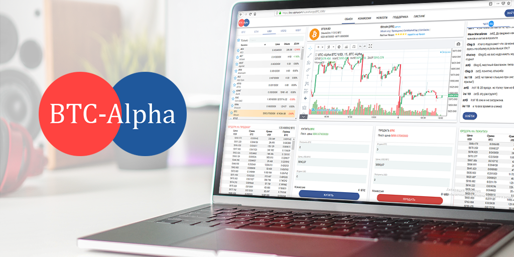

# BTC-Alpha

 

 

## About

BTC-Alpha is a digital asset trading platform providing advanced financial services to traders worldwide since 2016. Our platform is a reliable, secure and stable environment for crypto trading with low commission fee and 24/7 customer support.
 
 
Our team is focused on providing the best customer experience and ceaseless product improving and developing. There are 98 coins and 188 currency pairs presented on the BTC-Alpha.
 
 
BTC-Alpha is one of the top world secure crypto exchange.
According to latest General Exchange Security Rating, provided by ICOrating, BTC-Alpha was ranked #14 out of 221 studied crypto exchanges with “A” rating.

<!-- ## Support this project

## TFGrid Solution

### Roadmap -->
