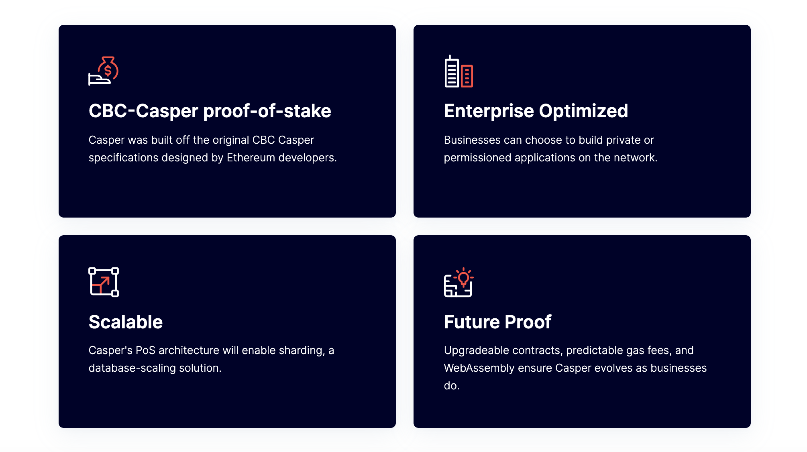

 

 

## About

[CasperLabs](https://casperlabs.io), the developer of the Casper Network, provides professional services and support for organizations building on the Casper Network. Guided by open source principles, CasperLabs is committed to supporting the next wave of blockchain adoption among businesses and providing developers with a reliable and secure framework to build private, public and hybrid blockchain applications. Its team possesses deep enterprise technology experience, hailing from organizations including Google, Adobe, AWS, Dropbox and Microsoft.

## CasperLabs and ThreeFold 

CasperLabs and ThreeFold have a shared belief that decentralization is needed in order to build a better tomorrow. According to CasperLabs, decentralization is "how we will create more open, transparent, permissionless networks powered by people — paving the way for a new era of equitable innovation."
 
 
As Web3 developers and enterprises around the world are looking for scalable, fast, cost-effective, public and/or private blockchains, CasperLabs provides a go-to-technology to build powerful and decentralized applications using its customizable smart-contracts abilities.
 
 
CasperLabs introduces blockchain technology for enterprises and developers with professional services around the globe. Enterprises building on top of Casper technology will be able to choose to run on ThreeFold's peer-to-peer cloud for storage and compute resources. This enables them to achieve security and scalability far beyond what the centralized cloud providers can offer today.
 
 
On a smaller scale, anyone will be able to contribute to Casper's blockchain security, resiliency, scalability and decentralization, by deploying a Casper Validator node on the ThreeFold Grid in just a few clicks. The ThreeFold deployment mechanism removes all technical complexity of running Blockchain nodes.

