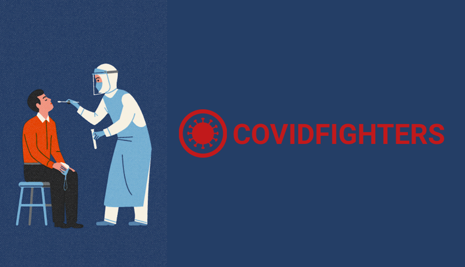
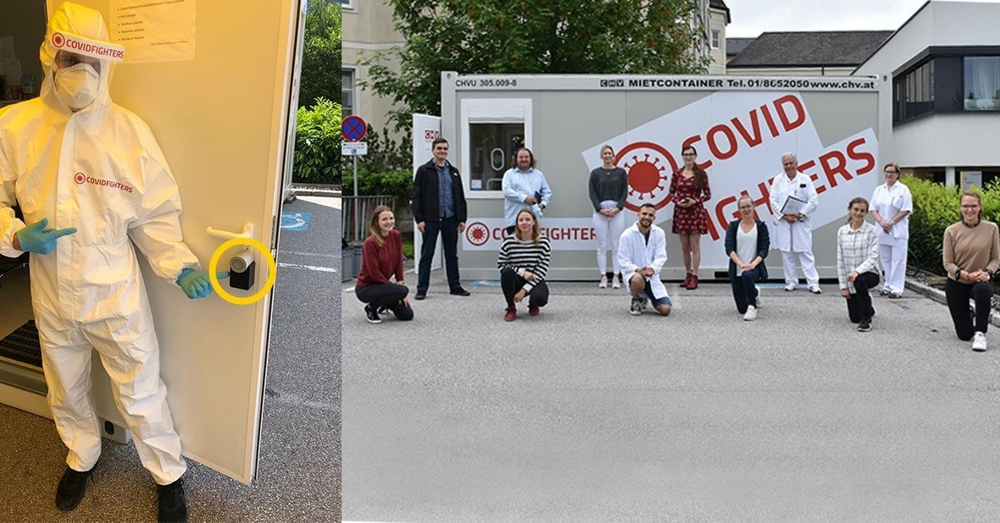

 

 

## About

COVID Fighters have built a technology consortium to test COVID 19 from a mobile unit to test whether or not a test subject is infected and contagious. The actual test takes only a few hours and the mobile unit can be deployed in a matter of days.
 
 
Various types of people (that need to be tested) can be tested easily and frequently and have their contamination state verified and stored in a way that is easily auditable. The process is end-to-end and involves remote medical specialists to assist and advise. COVID Fighters are putting this consortium together to make the world a safer place for people and economies to maintain their 'normal’.

 

<iframe src="https://player.vimeo.com/video/412336565" width="800" height="450" frameborder="0" allow="autoplay; fullscreen" allowfullscreen></iframe>

 

## Mission

To bring the highest standards of safety during Covid 19 while empowering people to maintain their ‘normal lives’ during such situations.

## Impact

By bringing the necessary solutions for mass testing and auditing, Covid Fighters can prevent the further spread of viruses such as Covid 19 while enabling individuals, businesses and economies to maintain their 'usual' ongoing activities. Considering how Covid Impacted our world, such solutions are of upmost importance to protect our poeple and economies.

 

 

## Powered by ThreeFold

Covid Fighters applications will run on the ThreeFold Grid. ThreeFold may also potentially provide 3bot technology to ensure privacy and security around people's data.

## Join saving our planet!

Providing the necessary technology, logistics and solutions to maintain a safe environment for societies while eradicating pandemics and other similar threats.

<!-- ## TFGrid Solution

### Roadmap
 -->

