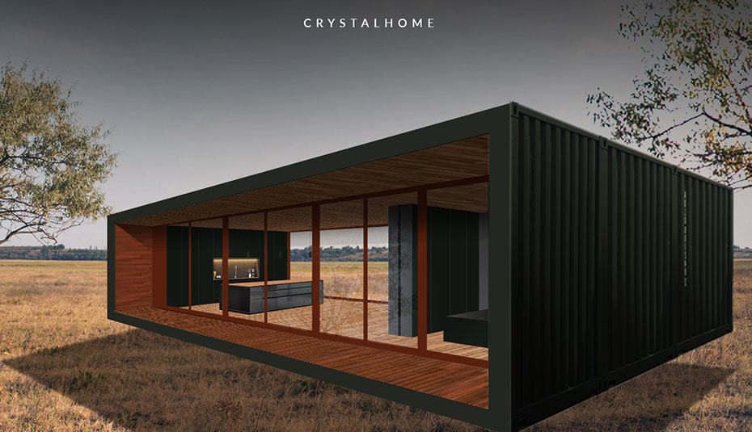

 

 

## About

Our planet needs a different approach to housing. The construction industry is one of the most polluting sectors out there, and we are changing it. We are building circular and fully self-sufficient homes that make housing construction affordable and sustainable without compromising on quality. All of the construction materials are second hand and refurbished for a new life.

 

<iframe src="https://player.vimeo.com/video/432586040" width="800" height="450" frameborder="0" allow="autoplay; fullscreen" allowfullscreen></iframe>

 

## Mission

Crystal Home is building circular & self-sufficient homes reducing the CO2 footprint and the waste flow of the construction industry. And by doing this project we also can provide many people affordable housing in a sustainable way.

## Impact

The linear “take, make, waste” economic model is reaching its limits. The environment simply does not have the capacity to sustain it anymore. A circular approach creates an economy that’s both sustainable and profitable.
 
 
We use the city as our source. All our materials are carefully harvested and refurbished to new standards by our partner-companies, ready for a second life. Example of the structures of our homes: Currently, there are 17 million shipping containers across the globe. Of those 17 million containers, however, only six million are actually being used for transport or any other practical usage. That means approximately 11 million shipping containers are unused and are just sitting stagnant all over the world. To reduce that amount is one of the main reasons we use them as our basic structure for the house.

## Powered by ThreeFold

Each crystal home can be equipped with its very own node, meaning each new home adds capacity to the more equal, fair, and sustainable ThreeFold peer-to-peer internet. This provides conscious connectivity to the crystal home owners and their surrounding areas.

## Join saving our planet!

Today’s challenges require bold and imaginative leaps into the future. They demand ideas that inspire, unite and create impact. Let’s reinvent reality together!

<!-- ## Support this project

Crystal Home is included in ThreeFold’s [Token Distribution Event (TDE)](https://library.threefold.me/info/tfgrid/#/tdeoverview)</a> for the impact it brings to our planet, humanity and the ThreeFold Grid.
The ThreeFold Token (TFT) represents a unit of capacity on the new Internet and is created only when new capacity is added to the ThreeFold Grid.
Each project on the TDE benefits from TFT fund allocations. You can buy TFT's and support Crystal Home, and the growth of a new Conscious Internet. -->

<!-- ## TFGrid Solution

### Roadmap

- Q1 2021
    - First 10 Crystal Homes Sold
- Q3 2021
    - Ingegrate 3Bot/Crystal Twin in Crystal Home -->
