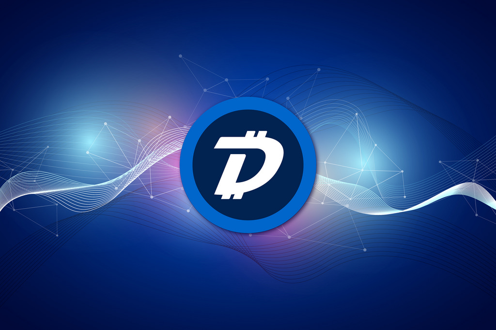

 

 

## About

[DigiByte](https://digibyte.org/)'s vision is to empower a sustainable decentralized world. The core values of the DigiByte community are decentralization, inclusiveness, permissionless, integrity, transparency - openness, consensus, thought leadership. We aim to stimulate global adoption of our blockchain and similar technologies that fulfil the core principles of decentralization in general. Decentralization needs to happen to see a better redistribution of opportunities, growth and value within our global society.

 

<iframe src="https://player.vimeo.com/video/413179934" width="800" height="450" frameborder="0" allow="autoplay; fullscreen" allowfullscreen></iframe>

 

## Mission

DigiByte is more than a faster digital currency; it is an innovative blockchain that can be used for digital assets, smart contracts, decentralized applications and secure authentication.

## Impact

Thousands of volunteers from all over the world have contributed to DigiByte in countless ways for years to make it what it is today. DigiByte is a collective movement to protect and promote the true principles of decentralization and empower communities to establish and maintain a sustainable decentralized world. The DigiByte Foundation aims to initiate and promote projects and community initiatives, but also promote the DigiByte ecosystem and further development by supporting creators, developers and marketers, with a focus on outreach, awareness, education, adoption.

## Powered by ThreeFold

The DigiByte network runs on a mix of servers managed by DigiByte volunteers and virtual machines or containers in commercial cloud provider environments.  This is decentralized to a degree but can be more decentralized if the DigiByte blockchain nodes can run on ThreeFold Grid nodes truly decentralized, energy-efficient and everywhere.

## Join saving our planet!

ThreeFold's technology helps the DigiByte software to use less underlying capacity for processing and that networking enhances time to reach consensus.  DigiBytes blockchain technology and multiple consensus mechanism together are a fantastic and sustainable platform to build (bespoke) Enterprise storage and blockchain technologies on.
