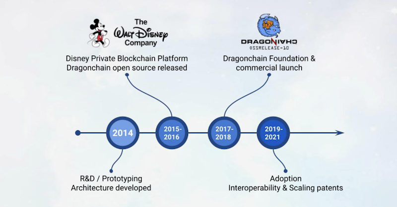

 

 

## About

Dragonchain is an affordable hybrid blockchain software development platform, offering secure and fast deployment of blockchain powered business solutions written in any programming language, interoperable with any external blockchain, legacy system, and application, hosted in any cloud or on-premise environment. 
 
 
We hold multiple “holy grail” patents on blockchain technology, including patents on blockchain scalability, interoperability, and enterprise process orchestration. With the integration of quantum-safe encryption at the core of our architecture, we now offer customers quantum-safe data protection. Dragonchain has proven enterprise scalability surpassing the global Visa payment network over an extended period.
 
 
We offer decentralized identity, social media, archival systems, and advertising. Den.Social, a Dragonchain spin-off, has demonstrated the mass scalability of Dragonchain’s Enterprise NFT and tokenization services by minting hundreds of millions of NFTs. Den also brings a revolutionary new advertising model to the internet, where quality content and relevance is incentivized.

## Dragonchain and ThreeFold 

Dragonchain and ThreeFold share a common mission of providing developers and the digital world with a more inclusive and decentralized Internet infrastructure – one where data flows and is stored in a peer-to-peer environment, and where applications are computed by decentralized and community-owned protocols.
 
 
Now, developers and enterprises building Web3 applications can leverage and deploy Dragonchain’s Blockchain and advanced smart-contracts into their dApps, with the added benefit of utilizing ThreeFold to completely decentralize their cloud computing infrastructure – and deploy their solutions on the edge.
 
 
Together, Dragonchain and ThreeFold are also decreasing friction and opening more avenues for inclusion. The Dragonchain platform contains sophisticated and lightweight SDKs and enables enterprises to use their existing IT staff to deploy code in any coding language. 
 
 
Further, the Dragonchain developer community can now build Web3-native and P2P cloud-native applications without the need for prior Blockchain experience. Developers now have access to scalable industry-standard solutions like Docker, Kubernetes, S3 storage – and ThreeFold’s Quantum Safe Filesystem – to build applications for a decentralized environment. 
