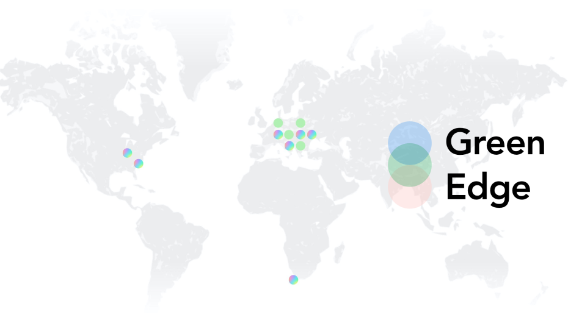

 

 

## About

Green Edge Sustainable Development is planning to offer affordable, distributed and decentralised storage and computing capacity for developers and partner telecom companies in Africa to locally host websites and other services. More than 360 million young people are currently excluded from the educational benefits afforded by internet access by poverty, geography or other circumstances. Green Edge Sustainable Development seeks to address this inequity.

 

<iframe src="https://player.vimeo.com/video/413148180" width="800" height="450" frameborder="0" allow="autoplay; fullscreen" allowfullscreen></iframe>

 

## Mission

Green Edge supports ThreeFold in creating a decentralised internet that is inherently equal, sustainable, fast, private and secure to empower our planet, humanity and technologies.

## Impact

The  United Nations Agenda 2030 declared: “to leave no one behind”. Green Edge Sustainable Development in collaboration with our telecom, educational and funding partners will work to connect the 3.6 billion people still off-line at an affordable monthly cost of $1 per person.

## Powered by ThreeFold

Green Edge Sustainable Development is the Environmental and Sustainability Impact arm of Green Edge, the largest global, independent ‘farmer’ on the ThreeFold Grid. Green Edge values and objectives are aligned with those of the ThreeFold Foundation and the Alliance for a Conscious Internet. The energy efficient, self-driving, automated technology developed by ThreeFold running on Green Edge computers is the technology combination that makes our ambitious programme possible.

## Join saving our planet!

Green Edge Sustainable Development’s overriding priority is to put the Planet First in everything we do. We want to bring the benefits of technology to the people in every area and every walk of life. But we must achieve this in the most energy efficient and secure manner possible and in a way that protects each person’s sovereign identity and their data from abuse and theft.

<!-- ## TFGrid Solution

### Roadmap
 -->