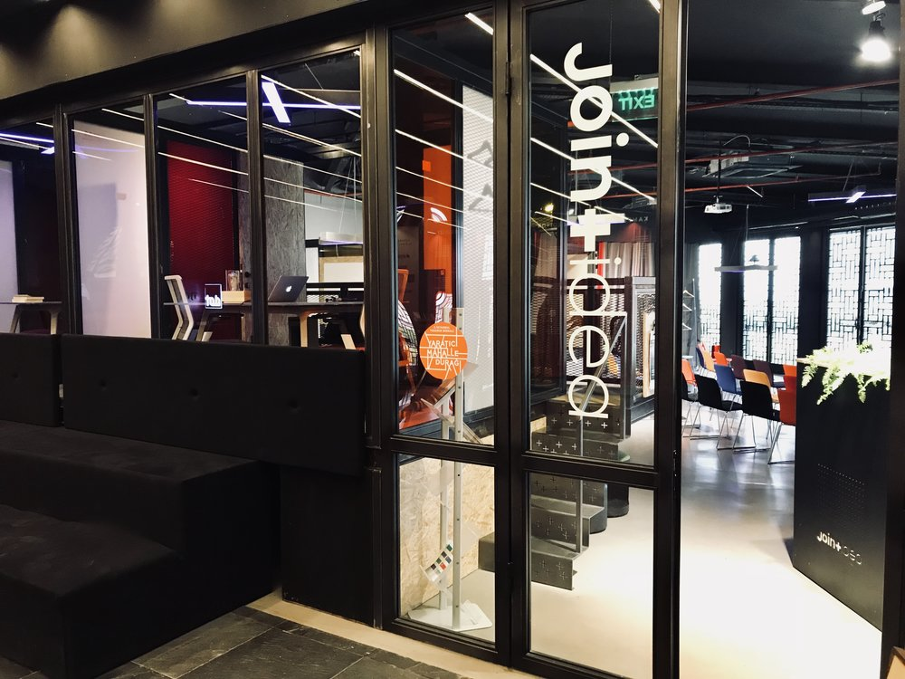

 

 

## About

**Joint Idea** is a synergy platform that cultivates consciousness, creativity, and serendipity by connecting ideas, people, place, and time.

## Mission

Our destination is Utopia. Our path is exponential humanity. Our mission is to get there together, as a human algorithm trained on the universal love for life as our guide. This mission cannot be achieved without technology, nor with the technologies that we are currently serving.

## Impact

Strengthening the humanity, love, and faith within us is necessary to avoid mass seduction by advertising based predictive algorithms and the sinister forces hacking our beliefs and behaviors in ways that we don’t yet grasp. We urgently need to create and adopt decentralized peer to peer technologies that amplify our limitless powers as connected conscious humans and as global citizens.

## Powered by ThreeFold

The promise of Threefold is to unleash technology that serves us, our communities, and our shared planet. This is an urgent need and there is no time left to squander. The Threefold approach offers a ray of hope at a time when it is needed the most.

## Join saving our planet!

It is up to us to avoid being reduced products of advertising platforms that are out to exploit our vulnerabilities, cognitive biases, and bad habits. 

<!-- ## Support this project

## TFGrid Solution

### Roadmap 

TODO: Add People? -->