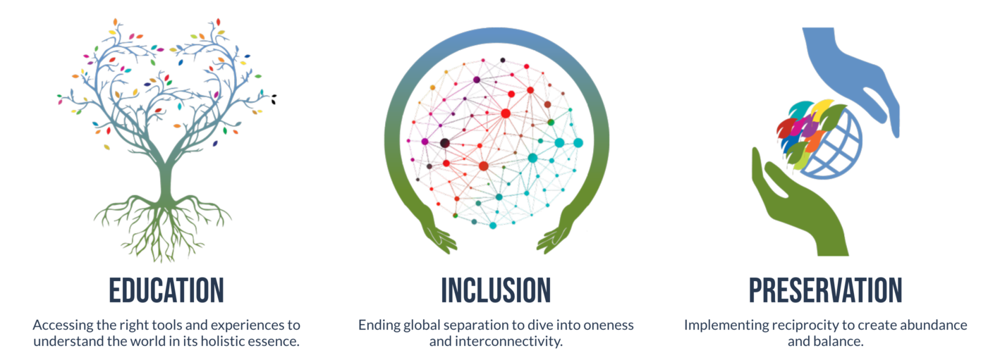

 

<iframe width="800" height="450" src="https://www.youtube.com/embed/Fm3aD4qlf-Q" title="YouTube video player" frameborder="0" allow="accelerometer; autoplay; clipboard-write; encrypted-media; gyroscope; picture-in-picture" allowfullscreen></iframe>

 

## About

Humanity is facing unprecedented ecological and societal crises. 
 
 

Le Ciel Foundation recognises that one of the main root causes of this crisis is a systemic separation between the material and the spiritual: our society has forgotten how to instil daily actions with purpose, values and principles that integrate within a global vision based on interconnectivity and collaboration with all life. And so, each one of our initiatives exists to catalyse this much-needed transformation.
 
 

Guided at every step by the values of wisdom traditions, we adopt a holistic and multi-layered approach to impacting change, addressing our individual and collective beliefs, behaviours, actions and systems.
 
 

Le Ciel Foundation addresses humanity’s separation from Nature and from its true nature. Bridging the wisdom of ancestral traditions with the know-how and ingenuity of modernity, we adopt a systems change approach to catalysing both individual and collective transformation.
 
 

We believe in a world of harmony and balance where all life, including humans, animals, vegetal and mineral life forms, on Earth and beyond are respected.

## Mission

We are here to catalyse a rapid shift in paradigm, to evolve to a way of living and being based on spirituality, ecology and oneness.
 
 

To create this better world, we focus on three foundational pillars : 

 

 

## Impact

Across the globe, the message from indigenous Elders is the same.
 
 

We have 4 years to change our current trajectory and embrace our true place in the global, universal plan, in full humility.
 
 

2024 will be a turning point for humanity and the chance to go from a revolution (circling to the same point humanity is at today) to a transcending evolution, spiraling up towards the unknown.
 
 

This sense of urgency is reinforced by reports from the U.N.’s intergovernmental panel on Climate Change (IPCC), urging society to drastically reduce its carbon footprint on the Earth and change its ways.
 
 

**It’s time to act!**

## Powered by ThreeFold

Holding the vision of what needs to be for all life to thrive harmoniously on our planet, we connect our current reality, ancestral knowledge, and modern technology.

