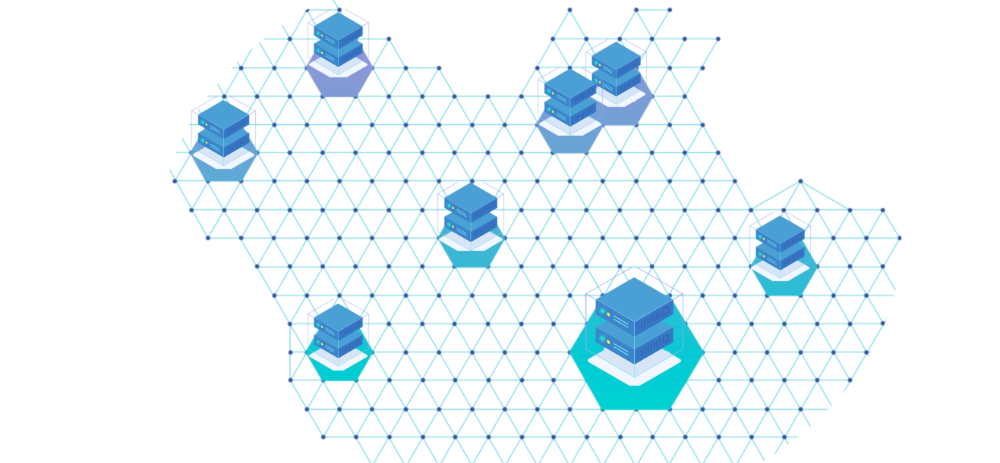

 

 

## About

[Mazraa](https://www.mazraa.io) is an independent Farming Cooperative based in Dubai UAE. IT runs a hosting farm of +120 servers. They are amongst the first farmers on the ThreeFold Grid and farm tokens on a monthly basis.
 
 
Mazraa is home to a group of consultants who support the growth of the ThreeFold Foundation and ThreeFold Grid. They deliver promotional services for the ThreeFold Foundation in order to support mainstream exposure and adoption. Mazraa also assists ThreeFold in the commercialization fo the ThreeFold Token.

<!-- ## Mission

## Impact

## Powered by ThreeFold

## Join saving our planet!

## Support this project

## TFGrid Solution

### Roadmap

TODO: Add People
 -->

