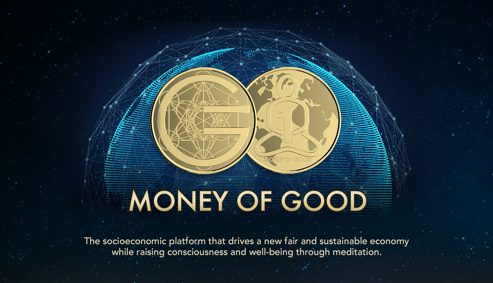

 

 

## About

[Money of Good](https://www.thefutureofgood.info) is a socioeconomic platform that uses disruptive proof-of-meditation technology (neurofeedback+blockchain) to offer people the chance to earn money as a reward for practicing meditation, improving their health, raising consciousness while fostering a new fair and sustainable economic model.
 
 
We love this approach because the reward mechanism based on proof-of-meditation makes it possible to run the most effective and reliable basic income program globally, empowering individuals economically at the same time that encourages large parts of the population to embrace the daily practice of meditation.
 
 
Plus, because the [currency issue](https://cda71153-0003-4d0a-acef-88cf4099ed33.filesusr.com/ugd/bc41a1_a40c5cac0327482fb6f0223ed9711982.pdf) mechanism is backed on the value generated by the collaboration between the MoG platform, customers/meditators, and the [B companies](https://www.bcorporation.net/) (businesses which are driven by creating positive impact) taking part in the conscious economic ecosystem, the platform feeds the new regenerative economy.

 

<iframe src="https://player.vimeo.com/video/424095155" width="800" height="450" frameborder="0" allow="autoplay; fullscreen" allowfullscreen></iframe>

 

## Mission

Driving the transition to a new fair and sustainable economy while raising consciousness and well-being through meditation.

## Impact

The main direct impacts are the raise of global consciousness and the birth of a new regenerative and conscious economic model. The sub impacts are the improvement of global health, the empowerment of individuals economically by minimizing inequality, and the leverage of sustainable local businesses.

 

<iframe src="https://player.vimeo.com/522276911/c40d6d27ae" width="800" height="450" frameborder="0" allow="autoplay; fullscreen" allowfullscreen></iframe>

 

## Powered by ThreeFold

ThreeFold will provide the perfect framework to run the blockchain (DLT/database) of Money of Good financial system. It will also make it possible to scale the solution for large populations by empowering people in places that used to have poor or no internet access to start their own  [Meditation Banks](https://youtu.be/6lFRJhUblvw) (places where people have free access to the proof-of-meditation reward system).

## Join saving our planet!
 
Join the [Future of Good](https://www.thefutureofgood.info/), the movement for a conscious, fair, and sustainable world for everyone.

<!-- ## Support this project

Money of Good is included in ThreeFold’s [Token Distribution Event (TDE)](https://library.threefold.me/info/tfgrid/#/tdeoverview)</a> for the impact it brings to our planet, humanity and the ThreeFold Grid.
The ThreeFold Token (TFT) represents a unit of capacity on the new Internet and is created only when new capacity is added to the ThreeFold Grid.
Each project on the TDE benefits from TFT fund allocations. You can buy TFT's and support Money of Good, and the growth of a new Conscious Internet. -->

<!-- ## TFGrid Solution

### Roadmap

- Q1 2021
  - Integration on TF Grid, 3Bot, TF Wallet -->

