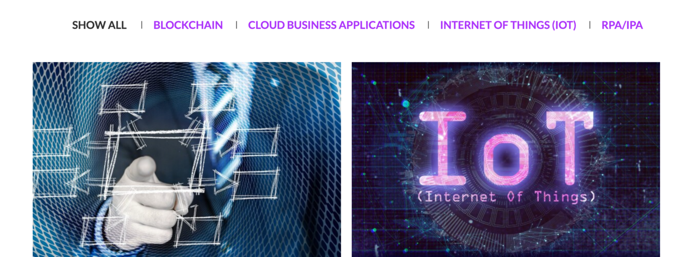

 

 

## About

Nebulai is the digital transformation solutions federator and global marketplace that addresses client’s business challenges with innovative digitally transforming solutions. In simple terms, we are the general contractors of digital transformation.
 
 

Nebulai brings best-of-breed solution partners across emerging technologies in order to provide technology-agnostic solutions. Our primary focus is to help our customers digitize their organizations and bridge the digital divide.
 
 

Nebulai is built on the idea of promoting integral relationships among its members and customers through trust or technology. We recognize our members for their work and contributions and help them monetize their contributions. We believe in the [Kaizen](https://www.investopedia.com/terms/k/kaizen.asp) continuous improvement methodology: by successive iterations, we approach perfection. We promote Ikigai or “the reason for being” which is how we foster work that our members are good at and which they love, and this makes connecting members to paying customers our [Ikigai](https://positivepsychology.com/ikigai/).

## Mission

Our mission is to bridge digital divide between technology partners and customer challenges through the use of innovative technology solutions.

## Impact

We are a technology for good company. Our objective at Nebulai is to create fair and trusted technology solutions and a human talent ecosystem. Our decentralized marketplace allows technology providers and human talent to sell and monetize their solutions and skills through Smart Contracts. Nebulai’s platform also enables new talent from universities, businesses, or disenfranchised individuals to join the digital economy and play a key role in its development.

 

 

## Powered by ThreeFold