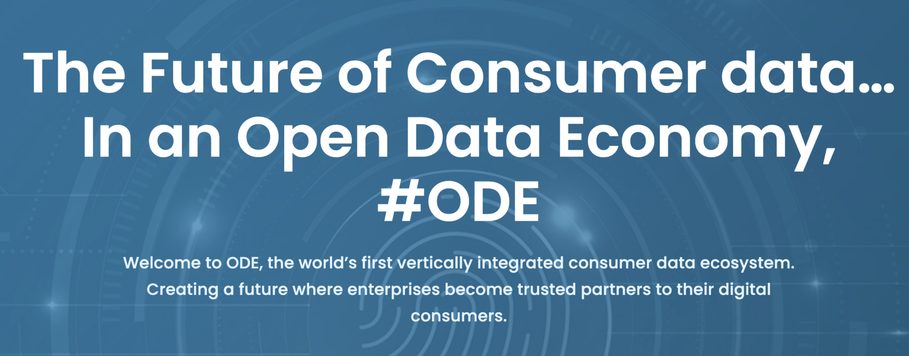

 

 

## About

[ODE](https://odeinfinity.com) is the first vertically integrated SaaS consumer data platform with a mission to change the world of consumer data privacy, lean data science and organic compliance. Built on blockchain and AI, ODE Infinity defines a new paradigm for digital engagement for enterprises. We are a passionate and ambitious team with the required balance of innovation, entrepreneurship and enterprise experience with Fortune 100 and successful exits. 
 
 
The current data supply chain is fragmented, archaic, and unethical and it is time for a new entrant to shape the future by disrupting it and dis-intermediating the data brokers to enable a direct and trusted relationship between enterprises and their digital consumers. We have built a significant demand across the world and are looking to launch our pilots later this year targeting 3 million users, and expect to achieve our financial targets ahead of schedule. 
 
 
We are excited about our journey and the traction we've achieved to date and are aligning with like-minded partners to effectuate an Open Data Economy that is both meaningful and rewarding.

## ODE and ThreeFold 

The partnership of the ODE Consumer Data ecosystem with ThreeFold’s ultra-secure, sovereign, scalable, and decentralized infrastructure platform is a complementary pairing which will empower a data economy focused on sovereignty, privacy, equality, and sustainability. The two companies are inspired by a shared mission of creating greater wealth distribution and equal opportunity for all of humanity to partake in this data economy.
 
 
ODE provides a solution that is secure, scalable, and will operate on Threefold’s cost-effective global infrastructure platform that complements the key attributes of ODE.  ODE  meets the attributes demanded by customers and actuates attributes including data sovereignty and privacy, true decentralization, no lock in, scalability, and ultra-security.
 
 
ThreeFold technology and the ThreeFold Grid offers an ideal infrastructure platform and meets these exact attributes demanded by the customers today. ThreeFold brings a truly decentralized compute and storage network that ensures the privacy and sovereignty of customer data, a quantum safe file system, scalability, cost efficiency, and ultimately a digital infrastructure.
