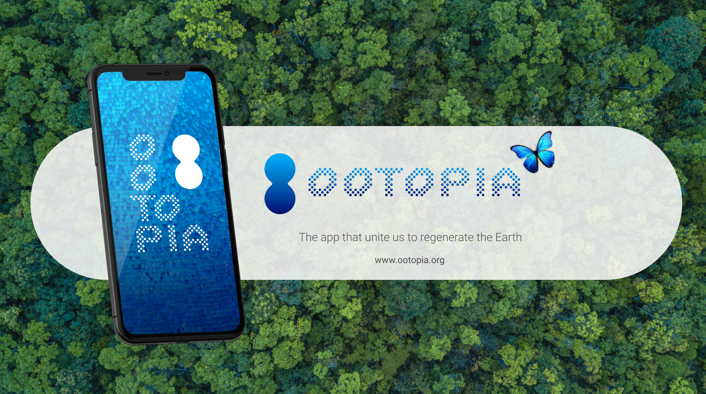
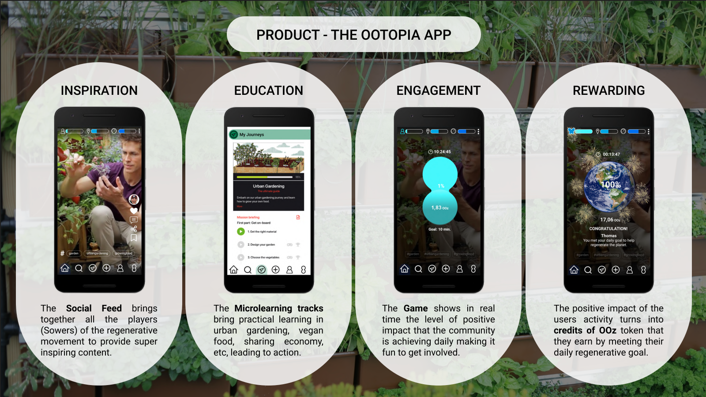
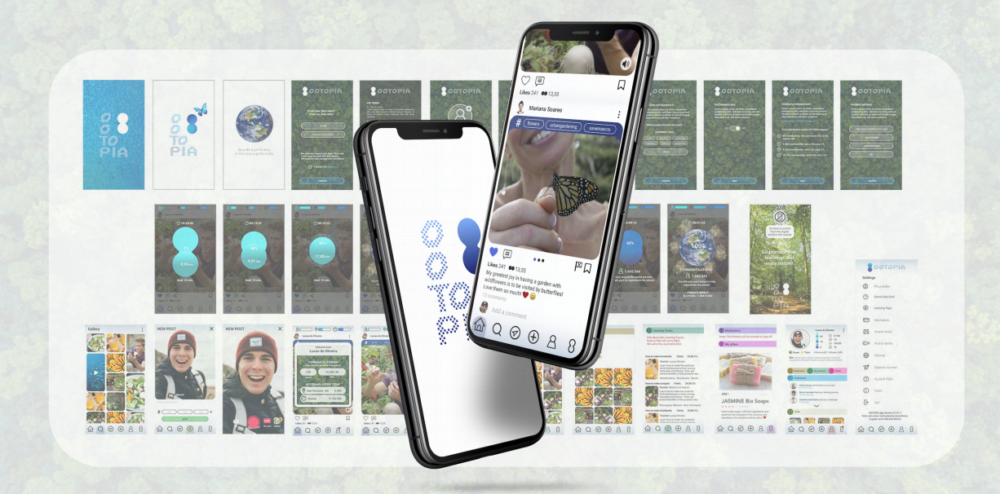
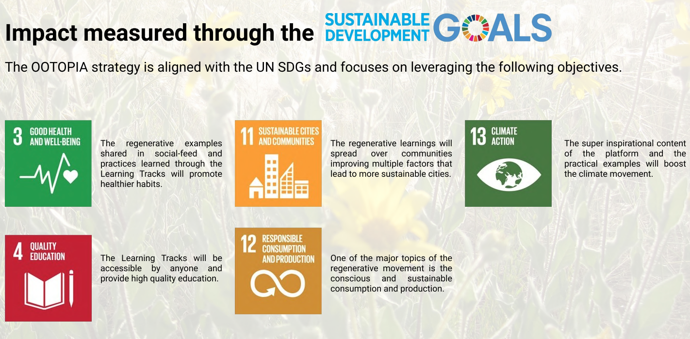

 

 

## About

Ootopia offers people the most exciting and easy way to engage on the planet regeneration and feel part of the solution.
 
 

Ootopia app combines super inspiring social media and microlearning in an exciting game where users are rewarded for their engagement with the impact token OOz.

 

 

## Mission

Who wants to be part of the problem, when they can be part of the solution. Our mission is to allow everyone to participate in building a better world.

 

 

## Impact

We are heading towards a total global collapse whose consequences will undoubtedly crash the environment, the economy, and the social structures threatening our own speaces.
 
 

Effective actions is not being taken bu global leaders, politicians or corporations.
 
 

For this reason, more and more people are afraid and eagerly looking for possible and accessible solutions at individual level.
 
 

Ootopia is one of these solutions.

 

 

## Powered by ThreeFold

## Join saving our planet!

Join the movement of and let's create a better future together.
