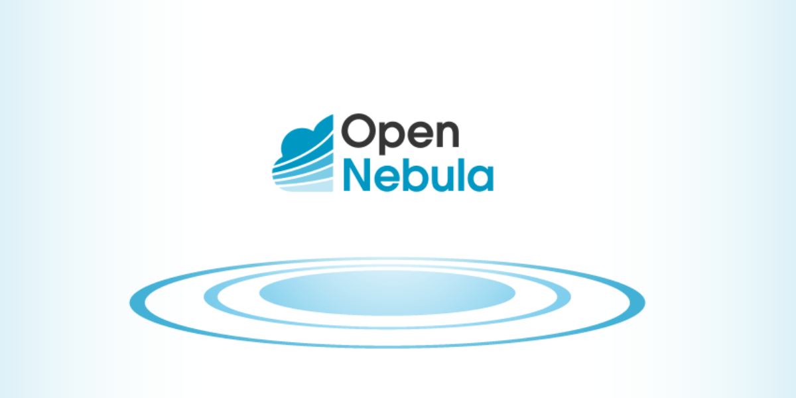

 

 

## About OpenNebula

[OpenNebula Systems](http://opennebula.io) develops the open-source cloud & edge computing platform OpenNebula, supports its Community, and provides SLA-based support, enterprise tools, consulting, and managed cloud services. OpenNebula Systems has a global presence with offices in Europe and the US.

## OpenNebula and ThreeFold

Together, ThreeFold Tech and OpenNebula Systems are [partnering](https://www.einnews.com/pr_news/580733691/opennebula-and-threefold-announce-agreement-to-explore-cooperation-in-open-source-and-edge-computing) to accelerate new, open-source and edge computing applications and joint innovation initiatives. The partners will set up technical collaboration and joint research on edge computing involving the open-source technology developed as part of the H2020 innovation project ONEedge (2019-2022) and ThreeFold’s highly-distributed peer-to-peer edge infrastructure to create Edge-as-a-Service environments.

 

OpenNebula Systems and ThreeFold Tech are developing these initiatives in a European Union context, including participation in Horizon Europe consortiums and in the IPCEI on Next Generation Cloud Infrastructure and Services (IPCEI-CIS). Areas of common interest will also be explored through support for the Gaia-X project, including Gaia-X Federation Services (GXFS) and Structura-X, and the SovereignEdge.EU initiative for defining an alternative, sovereign edge cloud stack for Europe.
