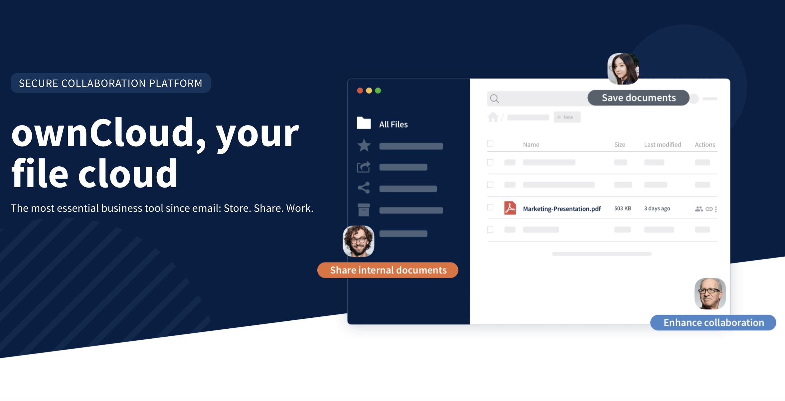

 

 

## About

ownCloud develops and provides open-source software for content collaboration, allowing teams to easily share and work on files seamlessly regardless of device or location. More than 200 million users worldwide already use ownCloud as an alternative to public clouds - and thereby opt for more digital sovereignty, security and data protection. For further information, please visit [www.owncloud.com](https://www.owncloud.com) or on Twitter [@ownCloud](https://twitter.com/ownCloud).

## ownCloud and ThreeFold

Based on a shared commitment to data sovereignty and open alternatives, ownCloud and ThreeFold have agreed to enter into a strategic partnership to advance the decentralization of the consumer cloud!

 

The first step in the partnership is the launch of the ownCloud instance on the ThreeFold Grid – demoed live at ownCloud Conference 2021 in September – and the development of  a pilot program to bring an interested subset of the ownCloud audience over to the ThreeFold Grid.

 

The long-term vision is a full range of file sync, file sharing and content collaboration solutions that combine the strengths of both technologies. ThreeFold and ownCloud are excited to develop complementary offerings that reflect their shared beliefs in open standards and digital sovereignty.
