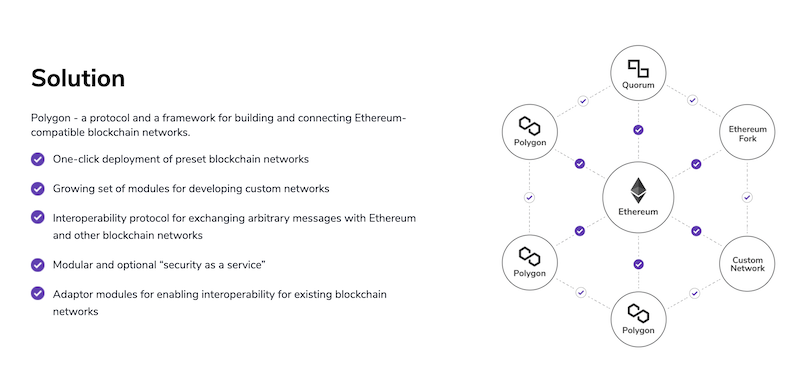

 

 

## About

[Polygon](https://polygon.technology/) (Previously Matic Network) is the first well-structured, easy-to-use platform for Ethereum scaling and infrastructure development. Its core component is Polygon SDK, a modular, flexible framework that supports building multiple types of decentralized applications.
 
 
Polygon is one of the go-to solutions for developers building dApps on Ethereum, as it effectively transforms Ethereum into a full-fledged multi-chain system (aka Internet of Blockchains). Using Polygon, one can create Optimistic Rollup chains, ZK Rollup chains, standalone chains, or any other kind of infrastructure required by the developer. 
 
 
With Polygon, new features are being built around the existing proven technology to expand the ability to cater to diverse needs from the developer ecosystem. Polygon will continue to develop the core technology so that it can scale to a larger ecosystem. The $MATIC token is playing an increasingly important role, securing the system and enabling governance.

## Polygon and ThreeFold

Polygon and ThreeFold joined forces to provide key benefits in successfully running a Polygon validator node and other related IT workloads, as well as providing decentralized cloud infrastructure for dApps powered by Polygon, which are primarily the ease-of-deployment, customization, privacy, and monitoring.
 
 
By leveraging the ThreeFold P2P Cloud and its developer tools (the Edge Virtual Data Center, 3Bot Virtual Admin, the quantum safe filesystem) the Polygon community – developers and non-developers – receive the following benefits:
 
 

- They can easily get started and run their own validators nodes for their staking directly from the web, and in just a few clicks.
- Polygon dApp developers can leverage ThreeFold's P2P infrastructure (compute and storage) to totally decentralize their IT infrastructure, and not rely on centralized cloud providers
 
 
Together we will expand Polygon's community-led Blockchain across the geographical edges, while creating a more inclusive and cost-effective participation model for anybody on earth to be involved in the growing Polygon ecosystem.

<!-- ### Roadmap

- Q4 2020
  - 1-click Matic validator node deployment
-Q1 2021 
   - Matic’s ETH  SideChain integration  with the ThreeFold grid and 3BOT:  Build autonomous Ethereum dApps on Matic, powered by ThreeFold’s P2P cloud
Q2 2021
   - Additional 1-click storage and compute solutions for the Matic community
 -->