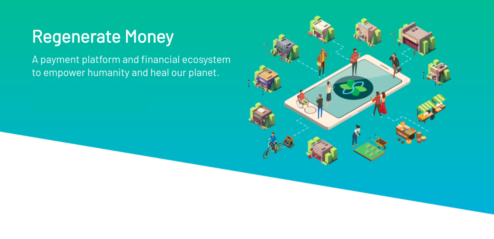

 

 

## About

[SEEDS](https://www.joinseeds.com/) is a regenerative financial system for a thriving global society. A global movement that aligns radical empowerment of purpose with finance with the mission to bring about a modern day Renaissance. Since its alpha release on November 5th 2019 and its public launch in March 2020, SEEDS has gathered 150+ alliance members from across multiple bioregions. We're leaving the age of siloed competition where people and planet were exploited by systems and entering an age of cooperation where the people are in direct control and ownership of the abundant systems they inhabit. We are in the stage of cultivating a grassroots movement uniting the people and organizations dedicated to a breakthrough towards genuine sustainability, freedom, and peace. 

 

<iframe src="https://player.vimeo.com/video/412275062" width="800" height="450" frameborder="0" allow="autoplay; fullscreen" allowfullscreen></iframe>

 

## Mission

SEEDS is a global movement that aligns radical empowerment of purpose with finance with the mission to bring about a modern day Renaissance. SEEDS is a regenerative financial system for a thriving global society.

## Impact

Holistic approaches are accomplished by evaluating the effectiveness through all four dimensions of natural, human, social and built capital. We measure effectiveness based on the valuation of all outcomes with the understanding that human activity should enhance the environment and the community by providing benefits to the majority and not only a few.

## Powered by ThreeFold

SEEDS and ThreeFold are a natural pair of decentralized cooperative internet to run a decentralized cooperative financial system. We intend to integrate our systems. Together we provide essential tools for shaping a civilization which is more resilient, rewarding, and regenerative.

## Join saving our planet!

The evidence is clear, the current system is reaching a historical moment that demands a paradigmatic shift. Join us!

<!-- ## TFGrid Solution

### Roadmap -->
