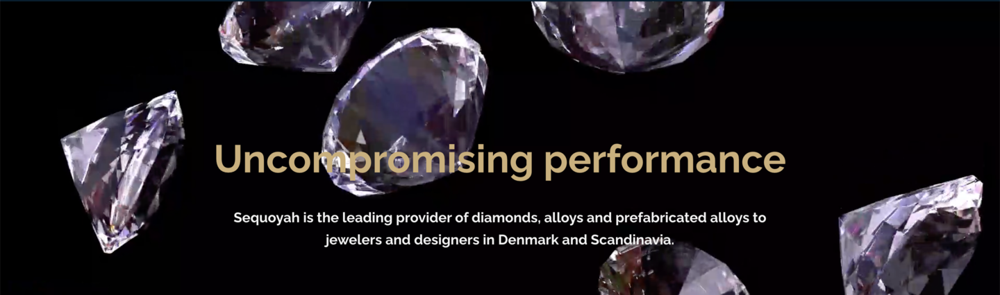

 

 

## About

Sequoyah is the leading provider of diamonds, alloys and prefabricated alloys to jewelers and designers in Denmark and Scandinavia.

## Mission

Ecologically sound, conflict-free sources for diamonds and alloys, and provide a safe haven for their customers' data - the gold of the internet.

## Impact

A partnership with TF Tech to build a decentralized banking system where by each user will have access to multiple digital and market assets at the palm of their hand.

## Powered by ThreeFold

Built on top of the ThreeFold Grid and using 3Bots to secure both identity and digital assets. Gateway to both fiat & cryptocurrencies through the creation of a token that is fully backed by gold, and exchangeable over the counter with other cryptocurrencies.

And to provide a safe haven for their customers' data.