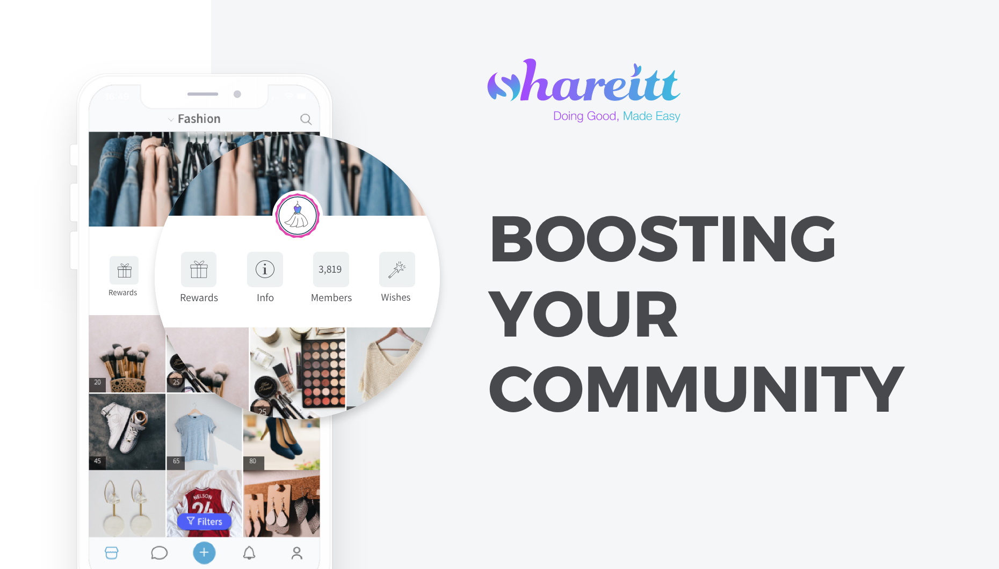

 

 

## About

[Shareitt](https://www.shareitt.com) aims to do good while doing well. We believe that changing the economic system and moving towards a sustainable business, cities, and communities is essential to create a healthy environment. Shareitt is an impact technology startup to empower communities socially, financially, and environmentally. Our unique technology redefines collaborative economies and mutual support and provides the tools to “Community Assets Based UBI” by nurturing long term capacities. All of Shareitt employees, management, and shareholders support the social impact, purpose, and objectives of the company.

## Mission

Enhance world prosperity to create a better world, where doing good becomes easy and rewarding.

## Impact

Facilitate and Empower communities socially, financially, and environmentally using a unique technology solution. With our tools, people, and organizations all over the world can create collaborative economies and develop thriving vibrant communities. Among the company goals for 2025 is Recycling more than 250 million items and creating an additional average save of 200 euros per month per user - in over 2500 communities using Shareitt.

## Powered by ThreeFold

Threefold provides a unique decentralized, uncontrolled Internet solution that will enable collaborative communities to exchange resources directly with one another without any controlling 3rd party. Communities all over the world with or without a stable internet connection will be able to operate a sustainable community that will serve their values and purposes.

## Join saving our planet!

A community of several hundred active women using our platform for 12 months resulted in: over 40,000 items reused within the community with zero footprint, a value of $360,000 exchanged and saved by the participants, hundreds of new friendships formed.

<!-- ## Support this project

Shareitt is included in ThreeFold’s [Token Distribution Event (TDE)](https://library.threefold.me/info/tfgrid/#/tdeoverview)</a> for the impact it brings to our planet, humanity and the ThreeFold Grid.
The ThreeFold Token (TFT) represents a unit of capacity on the new Internet and is created only when new capacity is added to the ThreeFold Grid.
Each project on the TDE benefits from TFT fund allocations. You can buy TFT's and support Shareitt, and the growth of a new Conscious Internet. -->

<!-- ## TFGrid Solution

### Roadmap

- Q1 2021
  - Integrate on ThreeFold Grid, 3Bot and TF Wallet

 -->