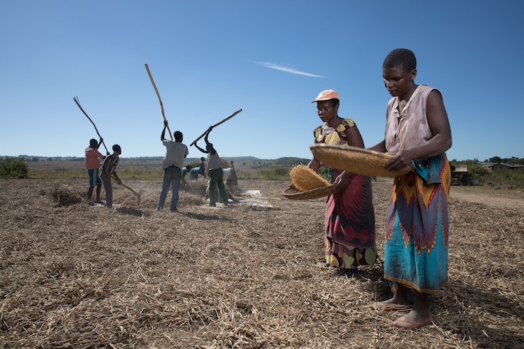
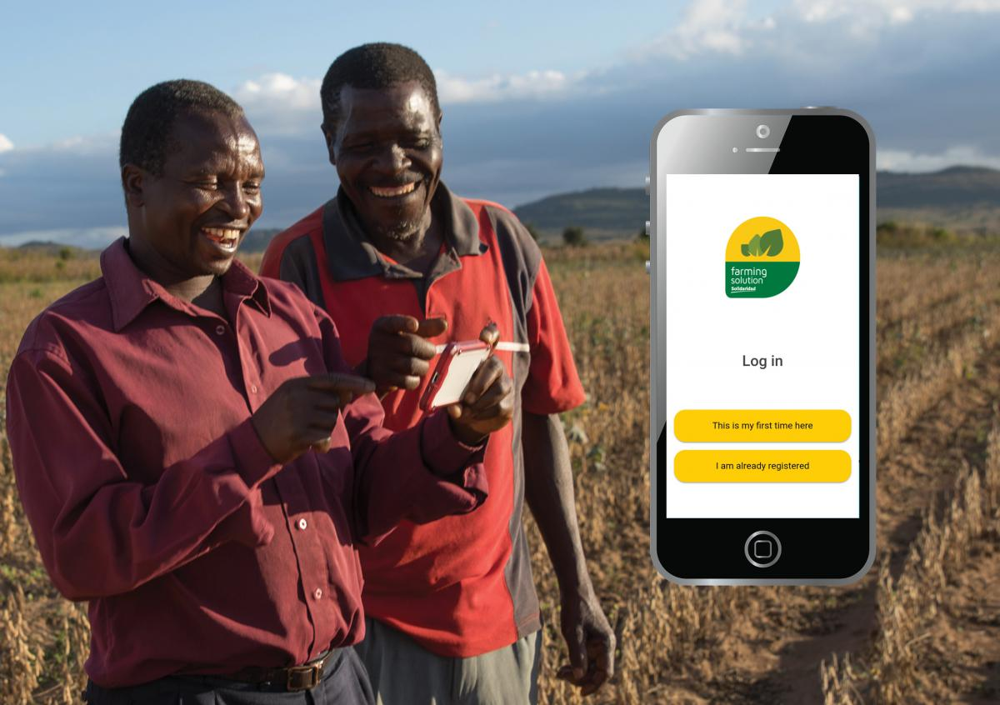

# Solidaridad

 

## About

The Solidaridad Network is an international civil society organisation founded in 1969. Its main objective is facilitating the development of socially responsible, ecologically sound and profitable supply chains. It operates through nine regional expertise centers in over 50 countries. Solidaridad seeks to transform production practices to promote fair and profitable livelihoods and business opportunities, decent working conditions and a fair living wage. Solidaridad without depleting the landscapes where people live and thrive.

 

<iframe src="https://player.vimeo.com/video/412688641" width="800" height="450" frameborder="0" allow="autoplay; fullscreen" allowfullscreen></iframe>

 

## Mission

With more than 50-years of value chain expertise, and an active network of more than 1.5 million farmers, miners, and workers across the globe, Solidaridad can play a transformational role in designing systems that can leverage technology to transform smallholder livelihoods worldwide. We are developing with Threefold a tokenized platform to incentivize communities to directly deliver intelligence and impact to companies, donors, and investors who are committed to the production of sustainable commodities, and will directly support an inclusive data economy for smallholder producers worldwide. It seeks to prove the concept of investment into impact and empowering communities as purveyors of their own data through the establishment of localized “gig” economies to drive producer agency and access to finance at the bottom of the pyramid for the larger development arena.

 

## Impact

By accelerating digital transformation in developing countries in ways that put communities in the driver seat, we will help to transform the livelihoods of hundreds of millions of smallholder families, by helping them build up the resources and access the services, markets, and finance they need. We can support a much needed planetary transition towards a greener economy, where farmers receive a fair share of profits and are encouraged to be better stewards of our planet. When we decentralize digital access and services, we can generate millions of green jobs at community level for youth, minimizing disorganized urbanization and building meaningful livelihoods for future generations in rural communities. We can also contribute to the increased resilience of regional and global food webs, and ensure the food security of current and future generations.

 

## Powered by ThreeFold

The values of data sovereignty and collaboration that Threefold embodies are central to our vision. We want to reclaim sustainability back to the communities who are the real stewards of our planet, and in today’s economy data plays a crucial role in achieving that vision. We are working together to tokenize farmers’ data and design innovative solutions that help them access services while retaining full security and ownership of their data. Through the 3Bot technology we are able to deliver a completely new pathway for farmers, and help them generate and market real impact. We are working to set up a development unit within Threefold’s Cairo team, and codesign the internet of the future for the world’s smallholders.

 

 

## Join saving our planet

Our vision is collaborative, we need to join forces and build a global coalition that shares a vision, but also a common platform with sufficient scale to upend the existing industries that extract value from our planet and our communities without providing anything back. We are interested in finding companies who want to change the way they source commodities, donors who want to maximize impact, and innovators who are looking for pathways to scale innovations that can work for our communities such as innovative connectivity solutions, content and analytics, infrastructure and match-making solutions, amongst others. We are also very interested in seeing how complementary currencies and local incentive systems can help communities adopt best practices and support the global fight against climate change.

<!-- ## TFGrid Solution

### Roadmap -->
