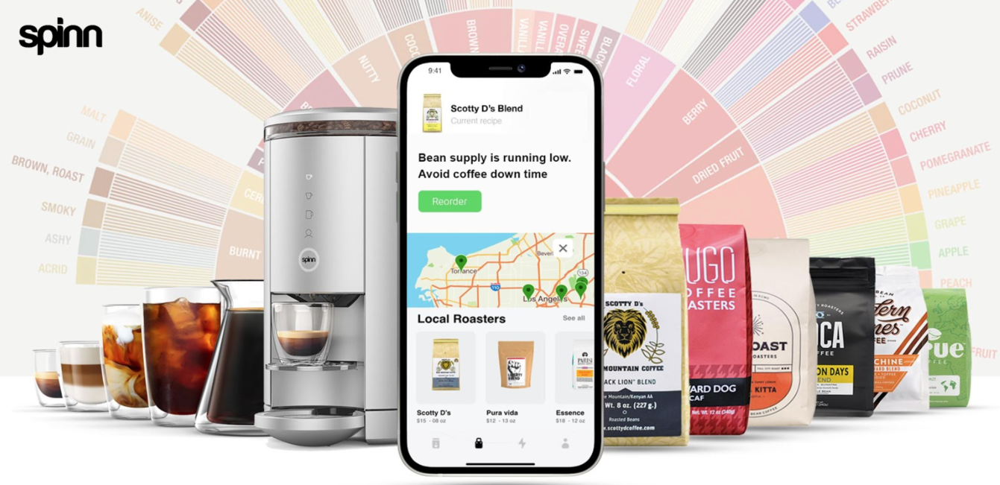
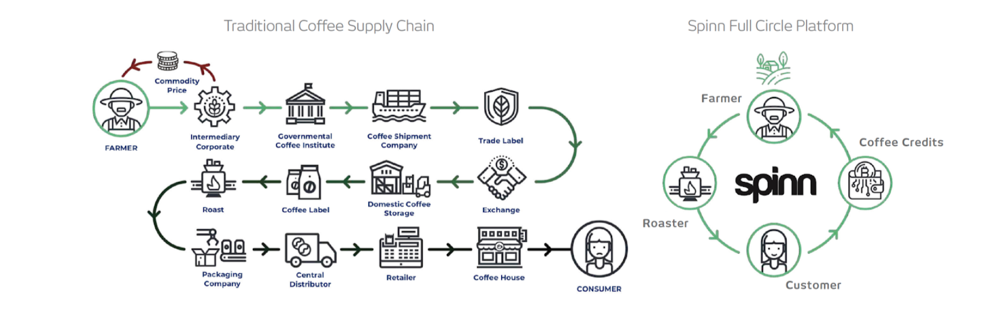

 

 

## About

Spinn is the World’s 1st Zero-Waste Coffee-as-a-Service Platform.
We created Spinn Coffee with the belief that high quality coffee need not sacrifice convenience; and that convenience need not be bad for you, your taste buds, or the planet. We were driven by a passion to create high-quality, bean-brewed coffee, crafted smartly with customizable convenience. All at the touch of a button – whether the consumer uses the sleek interface of the Spinn brewing system, or from wherever they are through the Spinn app.

## Mission

Our mission is to reimagine coffee for the connected age, and the discerning coffee lover.

 

<iframe width="800" height="450" src="https://www.youtube.com/embed/brmS9_dCBz4" title="YouTube video player" frameborder="0" allow="accelerometer; autoplay; clipboard-write; encrypted-media; gyroscope; picture-in-picture" allowfullscreen></iframe>

 

## Impact

Coffee farmers and roasters around the world - those that follow centuries of coffee tradition and have dedicated their lives to coffee - are getting increasingly frustrated with the industry that is not rewarding their craftsmanshift to deliver and create the coffee experience for the consumer. The coffee industry has developed monopolies in which the largest portion of rewards are reserved for coffee wholesalers and retailers, not the craftsman that grow and roast the coffee beans.
 

The coffeetrade is a massive **$362bn** worldwide market and there is a growing consciousness of taking action against unfair and old fashioned business models.

 

 

 
## Powered by ThreeFold

Spinn and ThreeFold are combining patents and technologies to turn the coffee industry up-side-down by introducing a new ecosystem of technology and (token) economics for the ground to cup journey of the coffee bean and creating a fair and level playing field for all parties involved.
 

To advance to a full sustainable cycle - growing to roasting, brewing to tasting, Spinn is partnering with ThreeFold where 
- Spinn will improve the patented coffee maker and connect it to the ThreeFold grid where is will collect, create, store and exchange information and tokens to normalise the economics from ground to cup. 
- ThreeFold will design and create the coffeetoken and it's digital marketplace plus make the coffee brewer an integral part of peoples contribution to a fair coffee industry and a more conscious and sustainable digital life.

## Join saving our planet!

Join us in creation of fair and equal Full Coffee life-cycle enjoying top-tier premium coffee while at it.

