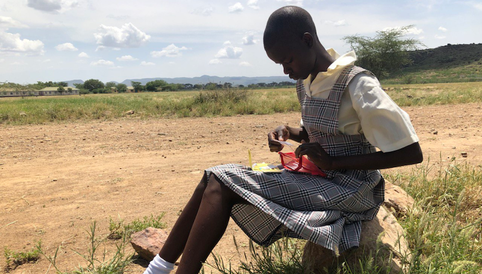
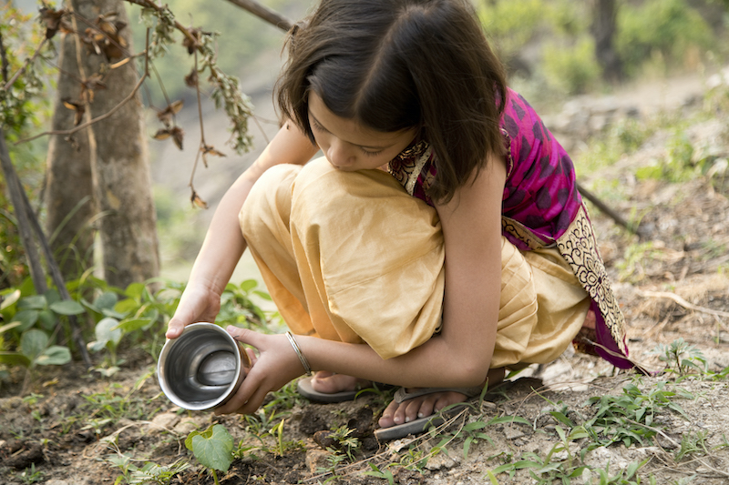

 

 

## About

Building on more than 60 years of classroom experience empowering students to be curious, ask questions, take action, and make a difference in their communities, we are bringing together like-minded educators seeking a different way of teaching and learning. The team at [TAG](http://www.takeactionglobal.org/) is committed to creating space for teachers and students to work at local and global levels for the betterment of humanity for today and for tomorrow.

 

<iframe src="https://player.vimeo.com/video/414512607" width="800" height="450" frameborder="0" allow="autoplay; fullscreen" allowfullscreen></iframe>

 

## Mission

To inspire change by providing opportunities for students around the world to take action on social good causes through education.

 

 

## Impact

Through endeavors like the [Climate Action Project](https://www.climate-action.info/), our [Innovation Lab Schools](https://innovationlabschools.com/), and [Project Kakuma](https://www.projectkakuma.com/), we find ways to connect thousands of teachers with students around the world to provide free, quality, meaningful education.

We want to raise the bar of education by having experts to teach the students and by initiating teacher training with help of technology. For years we have been working to bring positive and needed change to the education system and this is another step forward. A peer-to-peer education system opens up the possibilities for learning and positive solutions for our world. Additionally we will be able to set up global projects to tackle climate change and other issues allowing students to connect, brainstorm, create, share, solve problems and take action.

 

<iframe src="https://player.vimeo.com/video/425810410" width="800" height="450" frameborder="0" allow="autoplay; fullscreen" allowfullscreen></iframe>

 

## Powered by ThreeFold

Our peer-to-peer platform will run on the ThreeFold Grid and will utilize elements of Digital Twin technology. The Video Chat (Meet) solution will be used to allow teachers to teach refugees. We have already been doing this for five years with Project Kakuma, and thanks to the ThreeFold we will be able to allow people globally to connect and learn from peers, including refugees and others living in harsh conditions.

## Join saving our planet!

Every child deserves an education. Inspire change. Take action. Join us making the planet a better place by fighting polarization and giving everyone in the world a quality education.

<!-- ## Support this project

Climate Action Project is included in ThreeFold’s [Token Distribution Event (TDE)](https://library.threefold.me/info/tfgrid/#/tdeoverview)</a> for the impact it brings to our planet, humanity and the ThreeFold Grid.
The ThreeFold Token (TFT) represents a unit of capacity on the new Internet and is created only when new capacity is added to the ThreeFold Grid.
Each project on the TDE benefits from TFT fund allocations. You can buy TFT's and support Climate Action Project, and the growth of a new Conscious Internet.

## TFGrid Solution

### Roadmap

- Q4 2020
    - Platform launch with focus on refugees
- Q4 2021
    - Platform extension with focus on climate change -->
