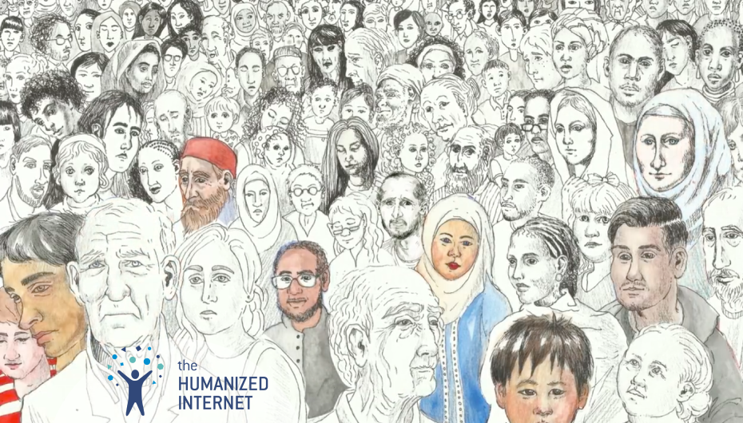

 

 

## About

[The Humanized Internet](https://www.moniquemorrow.com/humanized-internet) is working to use new technologies to defend the rights of vulnerable people, and give every human being worldwide secure, sovereign control over their own digital identity. The Humanized Internet is building a broad coalition of NGOs, international organizations and other actors to build a global consensus regarding each human being’s sovereign digital rights.

 

<iframe src="https://player.vimeo.com/video/442276485" width="800" height="450" frameborder="0" allow="autoplay; fullscreen" allowfullscreen></iframe>

 

## Mission

A non-profit organization focused on providing digital identity for those individuals most underserved.

## Impact

Over one billion people worldwide have no official identity, making them vulnerable to abuses like incarceration and human trafficking. That includes 230 million children under five, and ten million stateless people. Not only can a secure identity help defend their rights, but it can provide access to essential services like education, health and banking. It can enable them to be sovereign individuals.

## Powered by ThreeFold

ThreeFold has technology in place to run decentralized programs created by The Humanized Internet. In partnership with ThreeFold The Humanized Internet can scale it's mission of providing digital identity for large populations empowering people in places that are most vulnerable to identity abuse.

## Join saving our planet!
 
“Human dignity is based upon freedom, and freedom upon human dignity. The one presupposes the other.” Join us in creating Conscious Humanized Internet for everyone.

<!-- ## TFGrid Solution

### Roadmap

- Q1 2021
  - Integrate on ThreeFold Grid, 3Bot
 -->