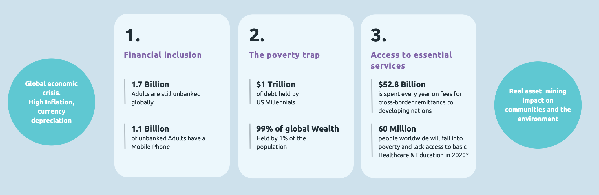
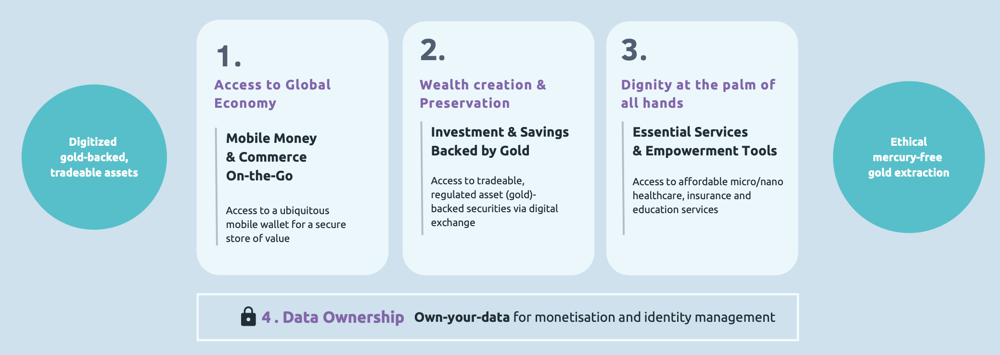
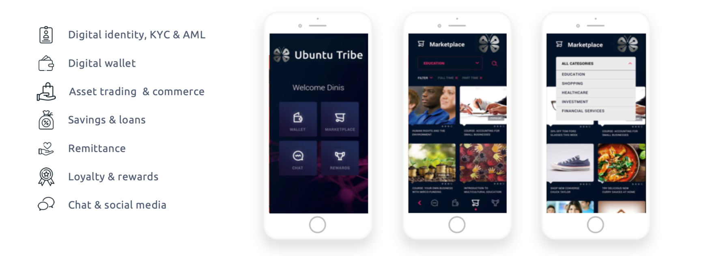

 

<iframe width="800" height="450" src="https://www.youtube.com/embed/1s0-ab7Daq8" title="YouTube video player" frameborder="0" allow="accelerometer; autoplay; clipboard-write; encrypted-media; gyroscope; picture-in-picture" allowfullscreen></iframe>

 

## About

We believe in a world where individuals and communities can have universal access to opportunities enabled by financial freedom and interconnected humanity.
 

Lack of access to basic financial services & wealth creation opportunities have created a global poverty trap. Additionally, The World Bank estimates that up to 60 million people will likely fall below the International Poverty Line of $1.90 per day in 2020, as a result of the pandemic.
 
 

 

Ubuntu is a digital, social commerce platform providing the tools for value creation, realisation and conservation at the fingertips, through mobile connectivity. This platform solves the 3-big pillars of “The Problem” accordingly.
 
 

 

## Mission

Ubuntu mission is very much in line with ThreeFold's - moving from an Ego-system to an Eco-system. We believe in an integral approach that embodies the best of all worlds where we go from "anticipating and controlling" to "feeling and adjusting" and we are commited to co-creating this Dynamic balance.

## Impact

Ubuntu Tribe's ultimate aim is wealth distribution and financial empowerment across the globe.

 

 

## Powered by ThreeFold

ThreeFold's unique decentralized, uncontrolled Internet solution serves as a perfect foundation for Ubuntu's digital, social commerce platform. Together we can secure equeal financial oportunities distributed globally and with full ownership in the most secure way.

## Join saving our planet!

Together we rise! Thank you!
