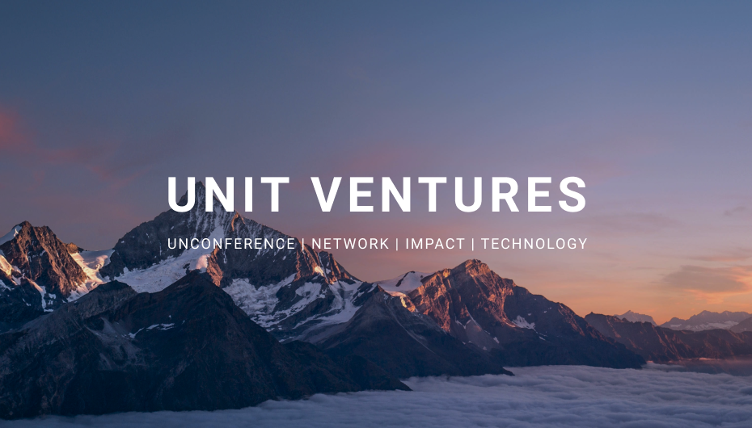

 

 

## About

At [Unit](https://ventures.unit.network/), wie want to support people who are passionate about something by helping them develop a business around it, by connecting them with clients, so they can support themselves, their family and friends.  So if someone wants to teach yoga, make art, sell cars, or design clothing - we support them by helping them develop a business around it. 
 
 
We have an underlying UNIT technology which powers two-sided marketplaces (like uber, or airbnb) which powers a platform for a specific vertical or industry. We invest in these projects and companies, with the vision to create millions of jobs, and support projects by allocating funds and resources to them.

 

<iframe src="https://player.vimeo.com/video/438885099" width="800" height="450" frameborder="0" allow="autoplay; fullscreen" allowfullscreen></iframe>

 

## Mission

To build the next economy.

## Impact

We believe well-being of all is important, and are committed to creating opportunities and solving inequality in the world by moving towards being structured as a cooperative, this means that the value created is distributed with the customers and providers, not just the founders and the investors. This will ultimately solve the huge income inequity. We believe  this will give an opportunity for people to do good, and focus on what they enjoy, rather than simply making money to support themselves.

## Powered by ThreeFold

We are planning to use ThreeFold's peer-to-peer infrastructure for the Unit.
 
## Join saving our planet
 
Reach out to one of our community members, to join the platforms or events, as well as if you’re interested in being a provider or customer to support the circular economy.

<!-- ## Support this project

Unit is included in ThreeFold’s [Token Distribution Event (TDE)](https://library.threefold.me/info/tfgrid/#/tdeoverview)</a> for the impact it brings to our planet, humanity and the ThreeFold Grid.
The ThreeFold Token (TFT) represents a unit of capacity on the new Internet and is created only when new capacity is added to the ThreeFold Grid.
Each project on the TDE benefits from TFT fund allocations. You can buy TFT's and support Unit, and the growth of a new Conscious Internet. -->

<!-- ## TFGrid Solution

### Roadmap

- Q1 2021
  - Integration on TF Grid, 3Bot
 -->
