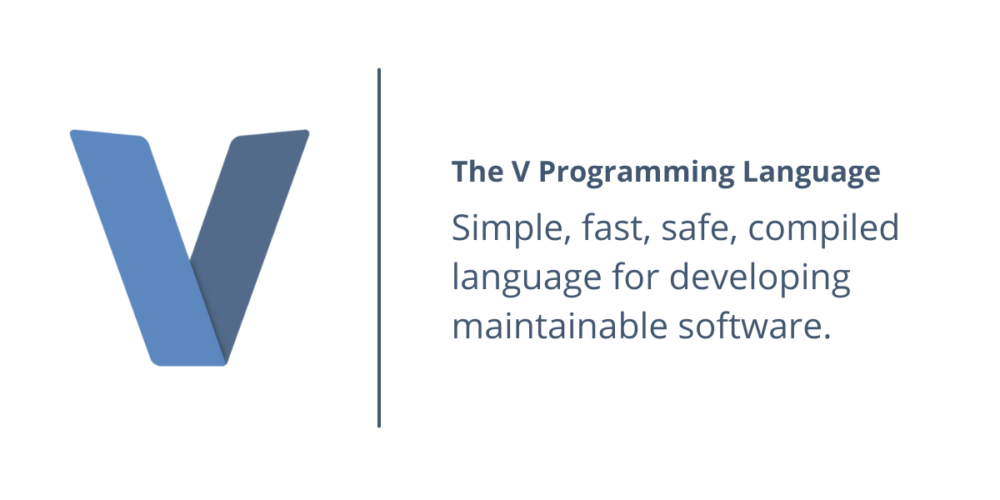

 

 

## About

[V](https://vlang.io) is a statically typed programming language similar to Go, and inspired by Rust, Swift, and Oberon. V was created because none of the existing languages had all of the following features: Fast compilation, simplicity and maintainability while providing great performance.  V’s safety is also incredible with no null, no global variables, no undefined, and support for bounds checking. By default, it also supports pure functions, immutable variables, and immutable structs.

## V and ThreeFold

V will become the official smart contract language on the [ThreeFold Grid](https://library.threefold.me/info/threefold#/tfgrid/threefold__tfgrid_home) throughout the first quarter of 2022. It’s simplicity and readability allows anyone to go through and understand any code base, even non-developers, making it the ideal smart contract language for the Threefold ecosystem. 

 

Despite being simple, V gives a lot of power to the developer and can be used in pretty much every field, including systems programming, webdev, gamedev, GUI, mobile, science, embedded, tooling, etc.

 

V aims to become an alternative to JavaScript as the de facto coding language on the market in the upcoming years. With V, the developer doesn't need to change anything in their code. "It just works", like in Python, Go, or Java, except there's no heavy GC tracing everything or expensive RC for each object. V can translate your entire C project and offer you the safety, simplicity, and 10-25x faster compilation speeds. 

 

With +27K Stars on [GitHub](https://github.com/vlang/v), V brings a strong open-source developer community to the ThreeFold ecosystem to develop the infrastructures and applications of tomorrow.
