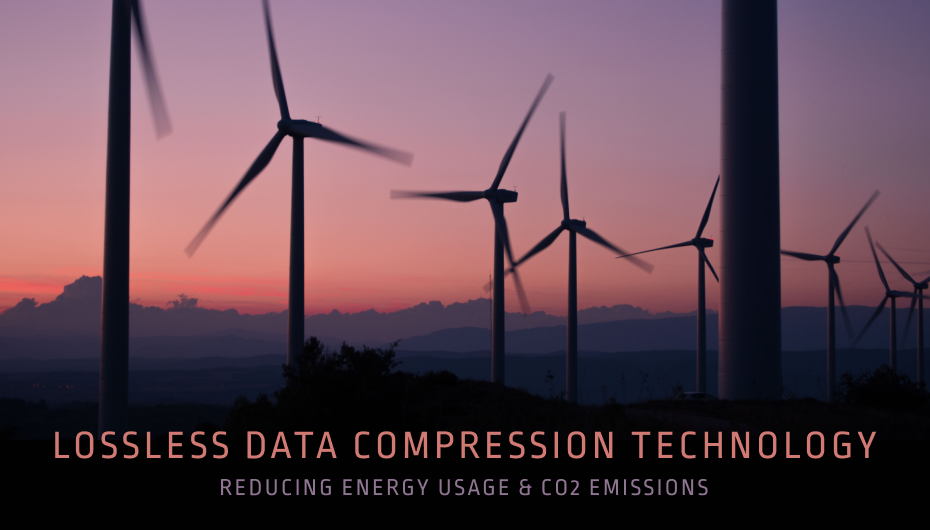

 

 

## About

We are creating, storing, and sending more data than ever before, and this trend will certainly continue as more people come online and with trends such as Internet of Things and 5G, as examples. More data means more energy consumption, which is not good for our planet.
 
 
For many years, research has been focused on increasing the capacity of 40 year old compressions algorithms (LZW) instead of developing new approaches. We at [Zetako](https://zetako.ai) believe that the world’s exponential data creation, processing and storage needs cannot be met with old optimized algorithms. To use Albert Einstein's words: “We cannot solve our problems with the same thinking we used when we created them.”
 
 
This next part is a little geeky. :) We have developed a brand new mathematical theory based on Statistical Predictive modeling and applied this to a new lossless data compression technology. The result is a technology that provides 30% more compression and Speed and uses 70% less energy in the process. In addition to this, the technology is capable of doing bit-by-bit compression allowing for real time bandwidth reduction - the technology does NOT need a prior knowledge of the dataset to start compression. In layman terms, this means that our technology does not require the data stream to be chopped up into chunks - we apply compression the moment the first bit (1 or 0) comes in.

 

<iframe src="https://player.vimeo.com/video/427718385" width="800" height="450" frameborder="0" allow="autoplay; fullscreen" allowfullscreen></iframe>

 

## Mission

Zetako is dedicated to reducing energy usage &  CO2 emission for the transmission and storage of data by applying a new lossless data compression technology.

## Impact

We are in a position to become the standard of lossless data compression for the next decades that will provide a solution to the problem of every growing amount of data and the energy used to transport and store it.
 
 
By reducing the size of data files - whether when transported or stored - we reduce the amount of energy that is required to do so and by reducing energy consumption we reduce C02 emissions.

## Powered by ThreeFold  

We will be embedded into the backbone of ThreeFold - the de facto lossless data compression algorithm being used - benefitting all stakeholders. In combination with ThreeFold's already-efficient infrastructure, we will provide State-of-the-Art lossless compression made for the 21st century, culminating it less use of resources for the benefit of all.

## Join saving our planet!

It is expected that in 2025 the world will produce 175 ZB of data and an eye-watering 9.000 Terawatt will be used to operate and handle this - We need to look at reducing the energy consumption that goes into our digital lives.

<!-- ## Support this project

Zetako is included in ThreeFold’s [Token Distribution Event (TDE)](https://library.threefold.me/info/tfgrid/#/tdeoverview)</a> for the impact it brings to our planet, humanity and the ThreeFold Grid.
The ThreeFold Token (TFT) represents a unit of capacity on the new Internet and is created only when new capacity is added to the ThreeFold Grid.
Each project on the TDE benefits from TFT fund allocations. You can buy TFT's and support Zetako, and the growth of a new Conscious Internet. -->

<!-- ### Roadmap

- Q1 2021
  - Integrate within ThreeFold Grid -->
