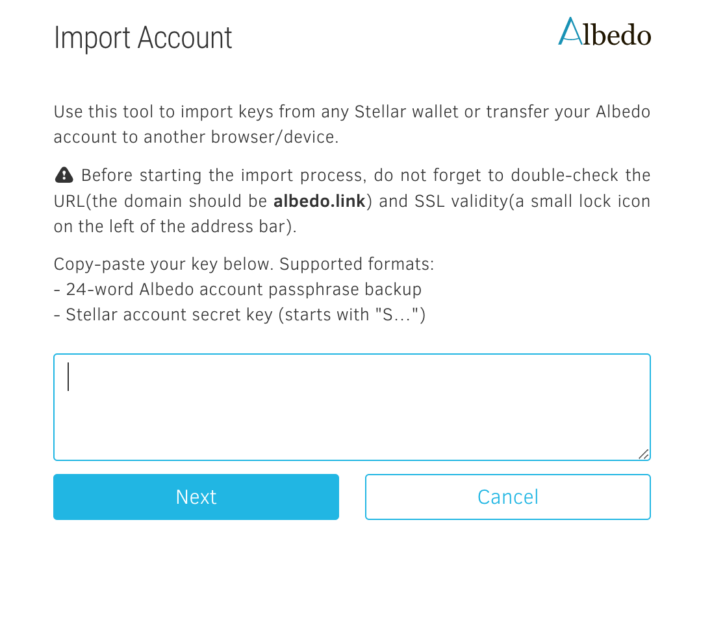
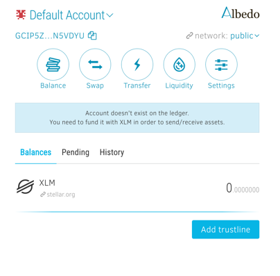
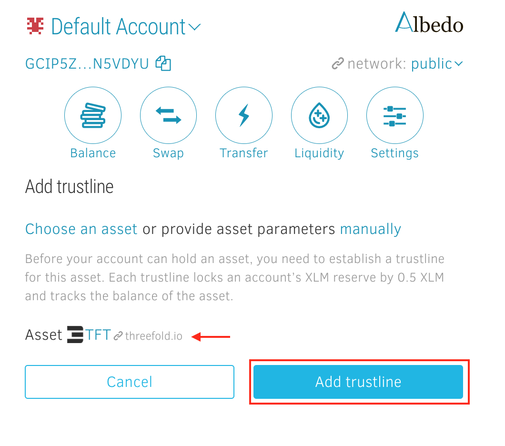
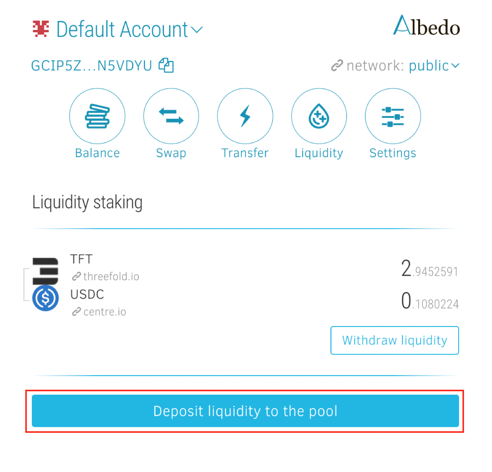

As we previously shared, we believe in the organic and sustainable growth of ThreeFold Token and the Internet of Internets vision. And one of our key goals is to strengthen the foundation of the ecosystem by enhancing the stability and liquidity of the ThreeFold Token (TFT). So today, we’re embarking on a little journey to find out how to access TFT and how to provide liquidity on Stellar via [Albedo](https://albedo.link/).

#### What are liquidity pools?

Liquidity pools are an integral part of DeFi systems and can be understood as a “[collection of tokens or digital assets stored in a smart contract](https://www.blockchain-council.org/defi/crypto-liquidity-pools/)” on a decentralized exchange (DEX). Liquidity pools allow users to buy or sell such assets in a decentralized way and are used to enhance decentralized trading, lending/borrowing and other DeFi services. Users get rewarded with a cut of the fees generated in the process to incentivize them to become liquidity providers.

#### What does it mean to drive liquidity on Stellar?

Stellar offers multiple great solutions and basically everything we need, so it’s crucial for us to start building our own liquidity there. Since every asset and currency starts with zero liquidity when issued on Stellar, it is up to the community to put capital onto the Stellar Network and to put that capital to use for trading, e.g. by adding liquidity to pools with TFT. The more liquidity we provide on Stellar, the more we contribute to creating and sustaining a healthy market for TFT there – while simultaneously attracting others to get involved in TFT.

#### About Stellar 

[Stellar](https://threefold.io/blog/thriving_with_stellar/) is an open network for storing, moving and trading any kind of money transparently and efficiently, with a thriving ecosystem on top and a huge community. Find out all about Stellar, its role for the TFT ecosystem, how to buy TFT on Stellar, and more [here](https://threefold.io/blog/thriving_with_stellar/).

#### About Albedo 

[Albedo](https://albedo.link/) acts as a single access point to the Stellar ecosystem. It’s a free, open-source, secure and simple browser wallet for the Stellar Network. Albedo allows other Stellar apps to request transaction signing or identity verification – without ever requiring the exposure of users’ secret keys. It’s a nice and simple browser-based keystore with wallet-, swap- and liquidity pool functionalities. 

 

Together, we will now go through the process of accessing TFT and providing liquidity on Stellar by using Albedo and its key features. All it takes are four simple steps:

1. Set up Albedo
2. Get TFT
3. Choose another asset
4. Add liquidity to a pool

## Step 1 – Set up Albedo

Albedo is not just a wallet. It’s a **keystore** that interconnects applications across the Stellar universe and signs a transaction or verifies your identity for you, without running the risk of exposing your secret key or having to create new accounts for every Stellar application. 

### Step 1.1: Open Albedo

Albedo works as a **web app and browser extension**, meaning you can either access it in your browser or install the extension on [Chrome](https://chrome.google.com/webstore/detail/kbojmmmibkfijmjgnfgfpngmmgkkpncl) or [Firefox](https://addons.mozilla.org/en-US/firefox/addon/albedo-signer-for-stellar/). Once you’ve either opened Albedo in your browser or installed the extension, just follow the instructions.

 

For this step-by-step guide, I’ve chosen to open Albedo in my browser instead of using the extension.

### Step 1.2: Set up your Albedo account

First, click on the “Create Albedo account”-button. Next, click “Proceed” on the bottom of the Welcome page.

 

Now, you can choose between between three main options:

* Log in
* Import account
* Create account

If you already have an Albedo account, either directly **log in** or – if it’s the first time you’re using Albedo on a new device – click on the “Import Account”-button to **import the 24 word passphrase or secret key** and access your account.

 

 

If you’re new to Albedo, you’ll need to create an Albedo account first in order to use the keystore. Choose a **safe password** for this account and hit “Create account”.

 

 

You just set up your Albedo account! Make sure to carefully read the instructions on keeping your **recovery phrase** safe, before continuing.

 

 

Now you can check out your new account and play around with the settings, e.g. to change your account’s name. You also get an overview of all the possible ways to use Albedo.

 

### Step 1.3: Activate account on ledger

In order to make your Albedo account fully functional, you’ll need to initially activate the account on the ledger by sending at least **1.6 XLM** to your account’s address. 

## Step 2 – Get TFT
 
The time has come to fund your Albedo account with TFT. Simply swap other assets for TFT if you’re already holding some in your Albedo account or transfer TFT from other wallets.

 

*Good to know: Albedo doesn’t provide a direct fiat gateway. Visit our TFT knowledge base to discover all the ways you can [buy TFT](https://library.threefold.me/info/threefold#/tokens/threefold__how_to_buy?id=how-to-buy-amp-sell-tft), including fiat options.*

### Step 2.2.A: Deposit TFT to your Albedo account

If you’re holding TFT in a different wallet, simply transfer the tokens and send them to your Albedo account. Simply open your wallet and send TFT to your Albedo address. It’s best to copy your Albedo address which is displayed in the top-left corner by clicking on the copy-symbol – it’s not only faster but also safer as copying prevents you from making typos.

 

### Step 2.2.B: Swap XLM/USDC for TFT within Albedo

You could also stay within Albedo by buying XLM or USDC first and then swapping them for TFT.

 

 

***Important note**: I recommend buying XLM regardless of whether you’re choosing option A or B, as you’re going to **need XLM to pay for the transaction fees** within the Stellar Network anyways.*

### Step 2.3: Activate assets

Please note that you have to add a trustline for any asset you want to store in your Albedo account in order to activate it. Just go to “Balance” in your account overview. On the bottom of the page, you’ll find the “Add trustline”-button.

 

 

Click on “Add trustline”, then press the “Choose an asset” on the next page and type TFT into the “Select an asset”-field.

 

 

**Caution: make sure to select the right TFT** – the one with our logo that’s linked with our website threefold.io – as shown in the image below.

 

 

Now you can activate the selected asset by pressing “Add trustline”.

 

## Step 3 – Choose another asset

At this point, you already have TFT in your Albedo account, so it’s time to choose a second asset to combine with TFT as a trading pair like XLM or USDC. You can get XLM or USDC on many exchanges and then deposit it to your Albedo wallet.

 

Repeat the same procedure of buying/depositing/swapping and activating for this second asset – the other part of the trading pair you’ve chosen to provide liquidity to in a pool. We chose USDC.

## Step 4 – Add liquidity to a pool

For this guide, we’ll be depositing TFT and USDC in order to provide liquidity to the pool. 

 

So after creating and activating your account and assets on Albedo, you’re now holding TFT and USDC. You’re ready to add liquidity to the TFT <> USDC pool on Albedo.

### Step 4.1: Select assets & amount

Head to the “Liquidity” section in order to select the two assets you’d like to provide liquidity to and to set the amount of TFT and USDC you would like to provide to this pool.

 

### Step 4.2: Deposit liquidity

Now you’re ready to provide liquidity! Click on the “Deposit liquidity to the pool”-button located at the bottom of your screen to add the selected assets to the pool.

 

 

**Congrats, you’ve just added liquidity to the TFT <> USDC pool!** 

 

Now you’re a liquidity provider on Stellar! Other ways to contribute to Stellar’s liquidity pools are [xBull Wallet](https://xbull.app/) and [StellarX](https://www.stellarx.com/). No matter which of the interfaces you use, they all enable you to add liquidity to the same underlying pool on the **StellarDEX** for the trading pair you chose.

 

As exciting as this is, please don’t forget: With great decentralization comes great responsibility! So, do your own research on how liquidity pools work and make sure you understand the risks related to impermanent loss. Also, read [this advice](https://library.threefold.me/info/threefold#/tokens/threefold__threefold_wallets?id=important-notes) on keeping your TFT safe.

 

Feel free to ask any questions either in the [chats](https://t.me/threefold) or the forum’s [token section](https://forum.threefold.io/c/threefold-token/22)!

 

*Please note that the ThreeFold Token ([TFT](https://library.threefold.me/info/threefold/#/tokens/threefold__threefold_token)) is not an investment instrument. Also, this is not investment advice, everyone is free to make their own choices. So, do your own research and read our [disclaimer](https://library.threefold.me/info/legal/#/legal__disclaimer).*
